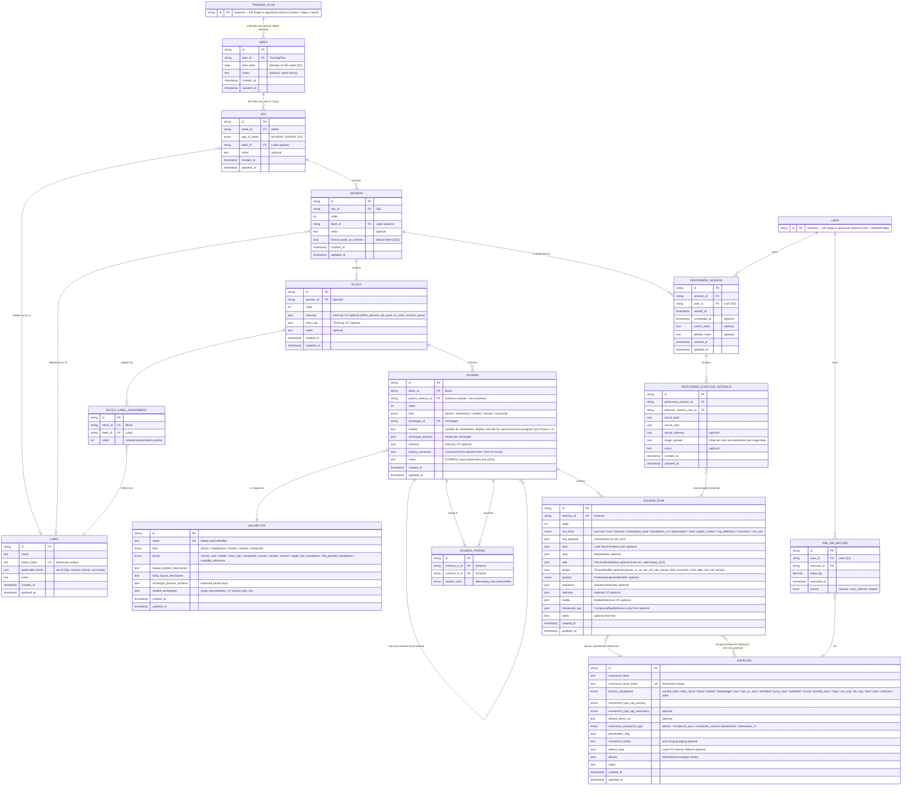

# Final ER diagram (Phase 6 formalization)

Финальный mermaid ER для Phase 6 после применения Q1-Q15 resolutions + дополнительных финализаций. Заменяет `05-synthesis/er-diagram.md`.

Идентификаторы — English; описания inline на English. Содержательный комментарий — Russian.

> **Revised 2026-05-12** — D1-D4 applied (Week as calendar slot, Athlete merged into `User` + `AthleteProfile`, `profileAttributes` dropped, library/configuration split). `User` и `TrainingPlan` теперь external stubs (full shape — в `packages/api-server/prisma/schema.prisma`). См. `implementation-notes.md` §0 (Phase 7 Integration Ratifications).

---

## §1. Key changes vs Phase 5 ER

| Change                                                 | Source                       | Effect                                                                              |
| ------------------------------------------------------ | ---------------------------- | ----------------------------------------------------------------------------------- |
| `BLOCK_LABEL_ASSIGNMENT` explicit join                 | Q7                           | many-to-many `Block ↔ Label` через таблицу с `order` field                         |
| `SCHEMA_PAIRING` explicit join                         | dual-FK для alternating-sets | bidirectional reference вместо JSON-FK                                              |
| `Session.freezeLoadsAtCreation`                        | Q10                          | per-session snapshot mode flag                                                      |
| `RowKind.REST_SLOT`                                    | Q12                          | новый row_kind для EMOM REST body                                                   |
| `Schema.notes`                                         | Q15                          | EXAMPLE-style explanatory annotation                                                |
| `PerformedSession` unique `(session, athlete)`         | Q9                           | latest-only per (Session, Athlete)                                                  |
| Pace = Intensity field (no `EASY PACE` label)          | Q8                           | label-catalog не содержит pace categorical labels                                   |
| `Exercise.canonicalName` case-insensitive unique       | Phase 5 ratify               | lower-индекс через generated column                                                 |
| Cross-movement `Percentage.reference.targetExerciseId` | Phase 5 final                | FK на Exercise для cross-exercise percentages                                       |
| `Intensity.hrZone` + `Intensity.numericPace`           | Q16, Q17 (Phase 7)           | HR zone categorical + numeric pace (run/row/swim)                                   |
| `TempoModifier.fullTempo`                              | Q18 (Phase 7)                | 4-digit Olympic tempo notation (eccentric-pauseBottom-concentric-pauseTop)          |
| `DropSetProgram` → `StagedProgram`                     | Q19 (Phase 7)                | rename + generalize (drop_set / wave / cluster) + `restBetweenStages`               |
| `super-set` archetype                                  | Q20 (Phase 7)                | ordered exercise sequence within single schema (A1/A2/B1)                           |
| `Equipment` enum +7 values                             | Q21 (Phase 7)                | ASSAULT_BIKE / ATLAS_STONE / JUMP_ROPE / ROW_ERG / SKI_ERG / SLED / YOKE            |
| `WEEK` model + `DayOfWeek` enum                        | D1 (Phase 7 ratification)    | `TRAINING_PLAN → WEEK → DAY` cascade; Day.order replaced by (weekId, dayOfWeek)     |
| `ATHLETE` model dropped                                | D2 (Phase 7 ratification)    | `OneRMRecord` / `PerformedSession` → `User` (external); `profileAttributes` dropped |

---

## §2. Core diagram

---

## §3. Notes on the diagram

### 3.1 Join tables

- **BLOCK_LABEL_ASSIGNMENT** — explicit join, заменяет M:N abstract на Phase 5 диаграмме. `(blockId, labelId)` unique + `order` для presentation. `onDelete: Cascade` от Block, `Restrict` от Label.
- **SCHEMA_PAIRING** — bidirectional FK для alternating-sets (block-009 case). `(schemaAId, schemaBId)` unique; `relationKind` enum (текущий: `ALTERNATING_SETS`; extensible — например `EMOM_SUB_PAIR`).

### 3.2 Self-reference schemas

`Schema.parentSchemaId` nullable → top-level vs sub-schema discriminator:

- `parentSchemaId IS NULL` → top-level (children of Block).
- `parentSchemaId IS NOT NULL` → sub-schema; parent.kind должен быть `NESTED`.

Depth: 2 уровня (top + sub). Sample не показывает sub-sub-schemas; модель не enforces invariant, но Phase 6 implementation может добавить validation rule (`subSchema.parent.kind === 'NESTED' && subSchema.parent.parentSchemaId === null`).

### 3.3 Row payload polymorphism

`SCHEMA_ROW.row_payload` — JSON discriminated по `row_kind`:

| rowKind               | row_payload shape                                                                                         |
| --------------------- | --------------------------------------------------------------------------------------------------------- |
| `EXERCISE`            | `{ exercise: ExerciseForm }` (atomic / compound / cyclical / sandwich / or_alternative / placeholder_ref) |
| `REST`                | `{ raw: string, parsed: RestSpec }`                                                                       |
| `FOOTNOTE`            | `{ marker, target, content: CompoundRow, typeLabel? }`                                                    |
| `STANDALONE_LOAD`     | `{ load: Load, scope: "applies_to_all_preceding_rows" }`                                                  |
| `STANDALONE_URL`      | `{ url, wrapped, appliesTo }`                                                                             |
| `PLACEHOLDER`         | `{ placeholder: PlaceholderPayload }` (kind, text, perSetAssignments?, pairedConcreteRowId?)              |
| `INNER_LADDER_MARKER` | `{ steps: number[] }`                                                                                     |
| `REP_DEFINITION`      | `{ equality: CompoundRepDefinition_inline_form }`                                                         |
| `CONNECTOR`           | `{ form, roundsCount? }`                                                                                  |
| `REST_SLOT`           | `{}` (empty body — REST sub-schema внутри EMOM)                                                           |

### 3.4 ExerciseRow ↔ Exercise cardinality

Две группы ссылок:

- `Schema_Row.row_payload.exercise.form = "atomic"` → один FK на Exercise (через JSON `exerciseId`).
- `Schema_Row.row_payload.exercise.form = "compound"/"cyclical"/"sandwich"/"or_alternative"` → N FK на Exercise (через JSON exerciseId внутри compound).

Persistence: JSON store с `exerciseId` строками; application-layer joins. Query-friendly access для cross-exercise reporting — отдельные derived tables / materialized view (Phase 6 / future).

### 3.5 Cross-movement percentages

`Load.kind = "percentage"` с `reference.scope = "other_exercise"` хранит `targetExerciseId` (string) — soft FK через JSON. Validation rule на app-layer: `targetExerciseId` должен resolve в существующий Exercise.

### 3.6 MovementFamily

`Exercise.movementFamily` — text field, не FK. Soft grouping для:

- OneRM fallback (DP1 c hybrid): `90% от snatch_family 1RM` если per-exercise отсутствует.
- UI grouping / discovery.

Если sample растёт (family >> 15) — upgrade до entity (Phase 6 / future).

### 3.7 PerformedSession latest-only

`(sessionId, userId)` unique per Q9 (renamed `athleteId` → `userId` per D2, 2026-05-12). Re-do session = создать новый Session (тренер копирует или generates), `PerformedSession` остаётся single per pair.

### 3.8 freezeLoadsAtCreation

Per Q10: при `true` все percentage Loads резолвятся в absolute kg при создании Session (snapshot). При `false` (default) — live formula: render-time resolution через текущий athlete's 1RM. См. `implementation-notes.md` §3.5.

### 3.9 Что НЕ в диаграмме

- **MovementFamily entity** — soft string field.
- **MediaReference table** — embedded VO в SchemaRow.media + Exercise.defaultDemoUrl. Library-wide URL dedup — future.
- **RestSpec / TimeCap / Intensity / Load / RepNotation** — embedded JSON VOs. Intensity несёт также Phase 7 поля `hrZone` + `numericPace` (см. §3.10).
- **StagedProgram (ex-DropSetProgram) / PerSetSubstitution / CompoundRow / CyclicalCompound / SandwichCompound / OrAlternative / SuperSetPair[]** — embedded VOs внутри SchemaRow.row_payload или Schema.archetype_params. StagedProgram = generalized rename DropSetProgram (Q19), покрывает drop_set / wave / cluster через `programKind`. SuperSetPair[] лежит в archetype_params для archetype `super-set` (Q20).
- **TempoModifier** — embedded в SchemaRow.tempo; Phase 7 расширен `fullTempo` (4-digit нотация Olympic / accessory tempo).
- **TrainingPlan / User** (external stubs) — full shape живёт в app-level `packages/api-server/prisma/schema.prisma`. В этом срезе показаны как PK-only nodes ради FK validity (см. D1, D2 в `implementation-notes.md`). `User` covers оба роля: coach создаёт План, athlete владеет OneRM / PerformedSession.
- **Calendar derivations** — week-end date (`startDate + 6 days`), ISO year+week number, per-day calendar date — derived в app layer, не stored.

### 3.10 Phase 7 extensions (Q16-Q21)

Все Phase 7 additions — additive над JSON-columns, никаких structural Prisma изменений кроме Equipment enum.

| Extension                                 | Carrier                                                                                            | Shape                                                                                                                                             | Use                                                                                                                                                                                    |
| ----------------------------------------- | -------------------------------------------------------------------------------------------------- | ------------------------------------------------------------------------------------------------------------------------------------------------- | -------------------------------------------------------------------------------------------------------------------------------------------------------------------------------------- |
| HR zone (Q16)                             | `Block.intensity.hrZone` / `Schema.intensity.hrZone` / `SchemaRow.intensity.hrZone`                | `{ zone: "Z1"\|"Z2"\|"Z3"\|"Z4"\|"Z5" }`                                                                                                          | Endurance / aerobic prescriptions. Athlete-specific BPM-resolver deferred — per D2 (2026-05-12) future `hrMax` lands as explicit column on `AthleteProfile` (app-level), не jsonb.     |
| Numeric pace (Q17)                        | `Block.intensity.numericPace` / `Schema.intensity.numericPace` / `SchemaRow.intensity.numericPace` | `{ value: "4:30", distanceUnit: "km"\|"mi"\|"m"\|"yd"\|"lap", paceType: "min_per_distance"\|"distance_per_min" }`                                 | Run / row / swim interval pace. Default `paceType="min_per_distance"`.                                                                                                                 |
| Full tempo (Q18)                          | `SchemaRow.tempo.fullTempo`                                                                        | `{ eccentric: n, pauseBottom: n, concentric: n, pauseTop: n }` (seconds; "X" eXplosive notation = 0)                                              | Olympic / accessory tempo (e.g. `3-1-2-0`).                                                                                                                                            |
| StagedProgram (Q19)                       | `Schema.archetypeParams.program` для `named-exercise-program`                                      | `{ programKind: "drop_set"\|"wave"\|"cluster", stages: Stage[], restBetweenStages?: RestSpec, ... }`                                              | Rename DropSetProgram → StagedProgram. Covers drop-set (existing), wave loading (5×3 @ 70/80/90%), cluster sets (5×[3+3+3]).                                                           |
| named-exercise-program FK (Q11 Phase 7.1) | `Schema.archetypeParams.exerciseId` + `Schema.header`                                              | `exerciseId: ExerciseId` (any Exercise valid), `header: string?` (display override; fallback `exercise.canonicalName + ":"`)                      | Resolver: `displayHeader = schema.header ?? (exercise.canonicalName + ":")` (`implementation-notes.md` §3.13). No abstract catalog entries — 149 canonical exercises only.             |
| super-set archetype (Q20)                 | `Schema.archetypeParams` (archetype = `super-set`)                                                 | `{ pairs: SuperSetPair[], restBetweenPairs?: RestSpec, rounds: number }`, `SuperSetPair = { label: "A1"\|"A2"\|..., schemaRows: SchemaRowRef[] }` | Bodybuilding / accessory super-set. Family = `ROUNDS_SETS` (не отдельная). SchemaPairing **не** reused — это ordered exercise sequence внутри одной schemы, не bidirectional relation. |
| Equipment +7 (Q21)                        | `Equipment` enum (Prisma)                                                                          | `ASSAULT_BIKE`, `ATLAS_STONE`, `JUMP_ROPE`, `ROW_ERG`, `SKI_ERG`, `SLED`, `YOKE`                                                                  | Professional CrossFit / strongman equipment. Alphabetical order в schema.prisma.                                                                                                       |

Archetype catalog: 33 → **34** после Phase 7 (super-set добавлен в family ROUNDS_SETS). `archetypeParamsSchema` для super-set = `{ required: ["pairs", "rounds"], properties: { pairs: { type: "array" }, rounds: { type: "integer" }, restBetweenPairs: { type: "object", nullable: true } } }`.

---

## §4. Cardinality matrix

| Relation                                     | Cardinality            | Ordered?            | onDelete       |
| -------------------------------------------- | ---------------------- | ------------------- | -------------- |
| TrainingPlan → Week                          | 1:N (0..N, indefinite) | by startDate        | Cascade        |
| Week → Day                                   | 1:N (0..7)             | by dayOfWeek (enum) | Cascade        |
| Day → Session                                | 1:N (0..N)             | yes (order)         | Cascade        |
| Day → Label                                  | M:1 (0..1)             | —                   | Restrict       |
| Session → Block                              | 1:N (0..N)             | yes (order)         | Cascade        |
| Session → Label                              | M:1 (0..1)             | —                   | Restrict       |
| Session → PerformedSession                   | 1:N (1 per User)       | —                   | Cascade        |
| Block → BlockLabelAssignment                 | 1:N (0..N)             | yes (order)         | Cascade        |
| BlockLabelAssignment → Label                 | M:1                    | —                   | Restrict       |
| Block → Schema (top-level)                   | 1:N (0..N)             | yes (order)         | Cascade        |
| Schema → Archetype                           | M:1                    | —                   | Restrict       |
| Schema → Schema (sub)                        | 1:N                    | yes (order)         | Cascade        |
| Schema → SchemaRow                           | 1:N                    | yes (order)         | Cascade        |
| Schema ↔ SchemaPairing                      | 2 FKs (A, B)           | —                   | Cascade        |
| SchemaRow → Exercise (atomic)                | M:1                    | —                   | (JSON soft FK) |
| User → OneRMRecord                           | 1:N                    | —                   | Cascade        |
| OneRMRecord → Exercise                       | M:1                    | —                   | Restrict       |
| User → PerformedSession                      | 1:N                    | —                   | Cascade        |
| PerformedSession → PerformedExerciseInstance | 1:N                    | —                   | Cascade        |
| PerformedExerciseInstance → SchemaRow        | M:1                    | —                   | Restrict       |

---

## §5. Cross-cutting invariants (post Phase 5 ratify)

1. **Bodyweight equipment ↔ Load.kind**: если `Exercise.primaryEquipment ∈ {BODYWEIGHT, BAND, PARALLEL_BARS, RINGS}` → `SchemaRow.load.kind ∈ {bodyweight, unspecified}` (никогда `absolute`). Soft warning на app-layer; не DB constraint.
2. **Placeholder ↔ PerSetSubstitution**: placeholder row без сопровождающего PerSetSubstitution annotation → UX warning «slot не назначен». Soft.
3. **Nested schema kinds**: outer Schema.kind=`NESTED`; sub-schema kind ∈ {`ATOMIC`, `HEADERLESS`}.
4. **Compound trailing load resolution** (DP4): см. `implementation-notes.md` §3.1.
5. **Intensity partial overlay** (Q3): per-field independent inheritance row → schema → block.
6. **Label.applicableLevels** — soft hint, не enforced. UI filters by current level. Mutation = keep existing assignments (Q2).
7. **Order semantics** (Q6): sparse integers, default 10/20/30 increments. Gaps allowed.
8. **BlockLabelAssignment** unique `(blockId, labelId)`: set semantics (no dups), ordered list (presentation).
9. **PerformedSession** unique `(sessionId, userId)`: latest-only (Q9). Re-do = new Session. Per D2 (2026-05-12), `userId` references `User` (external).
10. **Week** unique `(planId, startDate)`: один Week per ISO-week per Plan (D1, 2026-05-12). Day unique `(weekId, dayOfWeek)`: ≤7 Days per Week, индексированы перечислением, не sparse integer.

---

## §6. Rendering

Single mermaid `erDiagram` блок. Уже tested против standard mermaid spec (mermaid 10.x+).

Relations:

- `||--o{` — one-to-many mandatory parent, optional child.
- `}o--o|` — many-to-one optional.
- `}o--||` — many-to-one mandatory.
- `}o--o{` — many-to-many.

Entity blocks используют расширенный синтаксис с `PK`/`FK`/`UK` markers и quoted descriptions для clarity.
