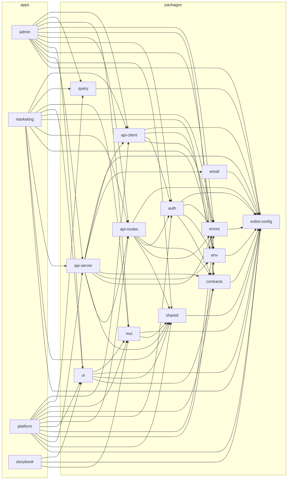

# Dependency graph

Auto-generated from [`.dependency-cruiser.cjs`](../.dependency-cruiser.cjs).
Refresh with `pnpm dep:graph`.

The graph is collapsed to package / app level (one node per directory under
`packages/` or `apps/`) so it stays readable. For the full file-level
view, run `pnpm exec depcruise --output-type dot packages apps | dot -Tsvg`.

This graph is enforced at the file-import level by
[`.dependency-cruiser.cjs`](../.dependency-cruiser.cjs) and the
dependency-direction rules documented in
[`BOUNDED-CONTEXTS.md` §8](./BOUNDED-CONTEXTS.md). Any pull request that
introduces a forbidden edge will fail `pnpm dep:check` both locally
(husky pre-push) and in CI (`.github/workflows/ci.yml`).

