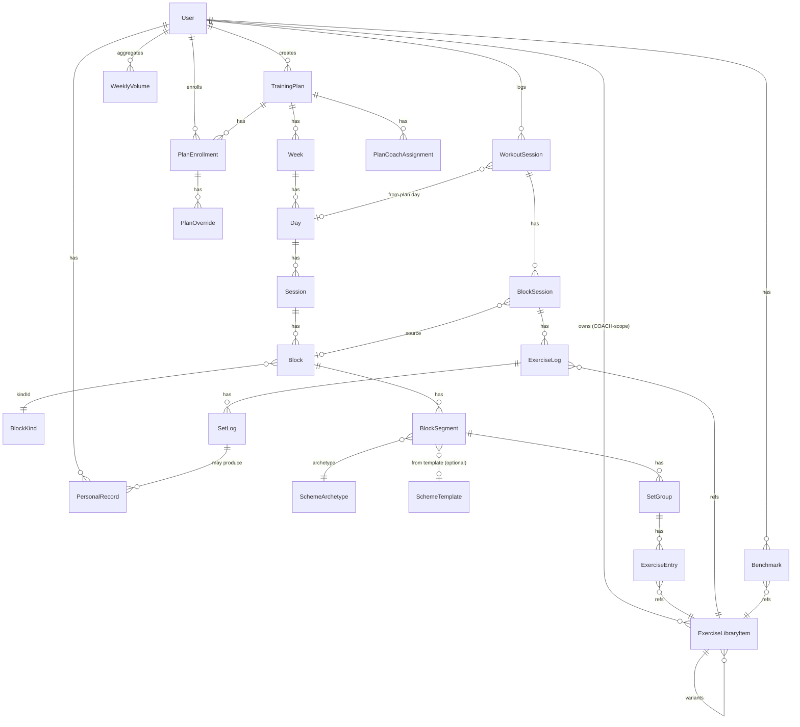

# Workout Editor & Domain Redesign

> **Тип:** дизайн-документ. Не код.
> **Mandate:** pre-product, БД пустая, sweeping breaking changes разрешены.
> **Дата:** 2026-04-26
> **Контекст:** redesign после нескольких раундов уточнений с product owner. Single-team модель (the-discipline-program — продукт под конкретную команду, не B2B SaaS).

---

## 1. TL;DR

1. **Текущий фундамент сломан.** `Workout.content` как HTML-tiptap делает невозможной любую аналитику (тоннаж, PR, плотность, compliance), таймеры, поиск, шаблоны. Сносим.
2. **Новая иерархия (7 уровней):** `Plan → Week → Day → Session → Block → BlockSegment → SetGroup → ExerciseEntry`. Block — контейнер сегментов (разминка может содержать бег + 3 круга упражнений + EMOM, каждый segment со своей scheme). Гибрид: реляционка для всего, JSON только для `BlockSegment.schemeParams`.
3. **Single-team.** Никаких Team-сущностей. Роли: `ADMIN` (тех. админ), `HEAD_COACH` (один — owner of the gym), `COACH`, `ATHLETE`. HEAD_COACH видит всё.
4. **Три библиотеки — отдельные сущности с CRUD:** **Exercise**, **BlockKind**, **SchemeArchetype** + **SchemeTemplate**. Управляются через `apps/admin` (полный CRUD + promote/demote) и `apps/platform/library` (тренер CRUD'ит свои + читает SYSTEM).
5. **Schemes — двухуровневая модель.** 6 hardcoded **execution archetypes** (`NONE`, `COUNT_UP`, `COUNT_DOWN`, `INTERVAL_LOOP`, `EMOM_LOOP`, `TIME_BOXED`) — это код таймеров. На них базируются произвольные **SchemeTemplate** (admin/coach создаёт named patterns). Покрывает CrossFit-canon.
6. **Logging переписываем 4-уровнево:** `WorkoutSession → BlockSession → ExerciseLog → SetLog`. Сносим `@@unique([userId, workoutId])`. Атлет может перелогировать.
7. **Аналитика gradient.** `WorkoutSession.completionRatio` (0..1) с weighted blocks (auto по BlockKind + manual override). Дашборд показывает 3 числа: full / partial / missed, не одно.
8. **Editor: three-pane** (Library / Plan canvas / Inspector + athlete preview). Notion-style inline pickers: `/` → scheme/block, `@` → exercise. Visual + Cmd+K command palette.
9. **Save model — НЕ blur-autosave.** Persist только on: explicit Save / card collapse / 8s idle (if valid) / Cmd+S / route change. Field-level blur НЕ триггерит save. Full-entity PUT, не partial patch. Optimistic concurrency через `version` field. Подробно — §7.14.
10. **Athlete UX defer на M3.** В M0–M2 — модели заложены, endpoints скелет, UI не строим. Фокус: admin-libraries + coach editor.
11. **Roadmap (задачами, не неделями):** M0 фундамент → M1 admin-libraries + coach editor → M2 analytics + import + mobile coach edit → M3 athlete UX + offline + i18n.

---

## 2. Текущее состояние

### 2.1 Что есть

- `Workout.content: String? @db.Text` (до 50k) — единственное хранилище структуры тренировки. HTML из tiptap.
- `WorkoutLog` — плоский: `date`, `notes`, `isRx Boolean`. Нет per-exercise / per-set capture.
- `@@unique([userId, workoutId])` блокирует повтор-логирование.
- `BenchmarkDefinition` / `UserBenchmark` — изолированные от `Workout`.
- Athlete-side в `apps/platform/src/app/athlete/page.tsx` — пустая "Coming soon" страница.
- Coach editor в `apps/platform/src/modules/plan-detail/components/week-workout-card.tsx` — title через `InputBase` + content через `RichTextEditor` (tiptap).
- DnD по дням / порядку существует и хорошо работает (`@dnd-kit` + `usePlanScheduleDnd`). Сохраним эргономику.

### 2.2 Что сломано

| #   | Сломано                                                     | Почему                                            |
| --- | ----------------------------------------------------------- | ------------------------------------------------- |
| 1   | Невозможен тоннаж по группам мышц                           | Упражнение не идентифицируется (HTML-string)      |
| 2   | Невозможен PR per movement                                  | Нет связи Workout↔Exercise                       |
| 3   | Поиск «все воркауты с pull-up»                              | Только text-search по HTML, ломается на синонимах |
| 4   | Атлет не может перелогировать                               | `@@unique([userId, workoutId])`                   |
| 5   | Нет таймеров под EMOM/AMRAP/INTERVAL                        | Scheme не существует как concept                  |
| 6   | Нет per-set capture                                         | `WorkoutLog` плоский                              |
| 7   | Тренер не строит блоки                                      | UI = title + HTML                                 |
| 8   | Тренер копирует одно и то же 50 раз                         | Шаблонов нет                                      |
| 9   | Импорт существующей программы тренера = 30 часов copy-paste | Парсера нет                                       |

### 2.3 ADR'ы под supersede

- ADR 0016 (workout content as plain text) — full supersede.
- ADR 0017 (anemic domain model) — partial supersede (для LMS-context — service layer становится необходим).

---

## 3. Доменная модель

### 3.1 Глоссарий

| Термин                                  | Определение                                                                                                                                            |
| --------------------------------------- | ------------------------------------------------------------------------------------------------------------------------------------------------------ |
| **TrainingPlan**                        | Долгоиграющая структура. Без даты окончания. Принадлежит coach'у (creator). Имеет статус DRAFT/ACTIVE/ARCHIVED. План = поезд.                          |
| **Week**                                | Контейнер 7 дней. `index` 0-based. Без даты.                                                                                                           |
| **Day**                                 | Один из 7 дней (`MON..SUN`). `kind: TRAINING / REST / YOGA / OFF`.                                                                                     |
| **Session**                             | Тренировочная сессия дня (1ST, 2ND...).                                                                                                                |
| **Block**                               | Логическая единица: контейнер сегментов. Имеет `kindId` (ref на BlockKind), `title`, `status (ACTIVE/SUSPENDED)`, `weight` (для compliance).           |
| **BlockSegment**                        | Внутренняя часть блока со своей scheme. Block может содержать N segments.                                                                              |
| **Scheme**                              | Конкретная комбинация archetype + параметры. Применяется на BlockSegment.                                                                              |
| **SchemeArchetype**                     | Одна из 6 hardcoded execution-примитивов (`NONE`, `COUNT_UP`, `COUNT_DOWN`, `INTERVAL_LOOP`, `EMOM_LOOP`, `TIME_BOXED`).                               |
| **SchemeTemplate**                      | Сохранённый именованный pattern (archetype + params). SYSTEM или COACH-scope.                                                                          |
| **SetGroup**                            | Группа упражнений внутри segment'а с общим rest config.                                                                                                |
| **ExerciseEntry**                       | Одно упражнение в группе. Reference на ExerciseLibraryItem + immutable snapshot + prescription.                                                        |
| **Prescription**                        | Что делать: reps/duration/distance/calories + load + tempo + sideMode + composition + alternatives + modifiers.                                        |
| **ExerciseLibraryItem**                 | Упражнение (DB Snatch, strict pull-up...). SYSTEM или COACH-scope.                                                                                     |
| **BlockKind**                           | Тип блока (WARM_UP, METCON, STRENGTH...). SYSTEM или COACH-scope. CRUD-управляемая сущность.                                                           |
| **PlanEnrollment**                      | Связь атлета с планом. `startedAtWeekIndex`, `startedOnDate`, `status`.                                                                                |
| **WorkoutSession**                      | Лог одного выполнения. Заменяет `WorkoutLog`. Multiple per Day allowed.                                                                                |
| **BlockSession / ExerciseLog / SetLog** | Уровни логирования внутри session'а.                                                                                                                   |
| **PersonalRecord**                      | Денормализованный PR per (userId, exerciseId, kind).                                                                                                   |
| **Benchmark**                           | Explicit referenceable PR-mark. Manual entry by HEAD_COACH или текущим coach'ем атлета или самим атлетом. Используется в `LoadSpec.PERCENT_BENCHMARK`. |
| **PlanOverride**                        | Per-enrollment кастомизация. M2 priority.                                                                                                              |

### 3.2 ER-диаграмма



### 3.3 Prisma-эскиз (только LMS, остальные модели не меняются)

```prisma
// === ENUMS ===

enum Role {
  ADMIN
  HEAD_COACH        // NEW
  COACH
  ATHLETE
}

enum DayKind { TRAINING REST YOGA OFF }
enum DayOfWeek { MON TUE WED THU FRI SAT SUN }

enum BlockStatus { ACTIVE SUSPENDED }

enum SchemeArchetypeKind {
  NONE
  COUNT_UP
  COUNT_DOWN
  INTERVAL_LOOP
  EMOM_LOOP
  TIME_BOXED
}

enum LibraryScope { SYSTEM COACH }

enum SideMode { BILATERAL EACH_ARM EACH_LEG ASYMMETRIC_HOLD UNILATERAL_ALTERNATING }

enum WorkoutSessionStatus { IN_PROGRESS COMPLETED ABANDONED SKIPPED }

enum RxStatus { RX SCALED SUBSTITUTED MODIFIED }

enum MovementPattern {
  SQUAT HINGE PUSH_VERTICAL PUSH_HORIZONTAL
  PULL_VERTICAL PULL_HORIZONTAL LUNGE CARRY
  ROTATION CORE_FLEXION CORE_EXTENSION CORE_ANTI
  CARDIO_RUN CARDIO_BIKE CARDIO_ROW CARDIO_OTHER
  GYMNASTIC_HOLD GYMNASTIC_INVERTED EXPLOSIVE COMBO
}

enum Modality {
  BARBELL DUMBBELL KETTLEBELL BODYWEIGHT
  CARDIO BANDED MIXED MACHINE
}

enum BodyPart {
  SHOULDERS CHEST BACK ARMS_BICEPS ARMS_TRICEPS
  CORE GLUTES HAMSTRINGS QUADS CALVES HIPS
  POSTERIOR_CHAIN FULL_BODY
}

enum SkillLevel { BEGINNER INTERMEDIATE ADVANCED ELITE }

enum PrKind {
  ONE_REP_MAX
  N_REP_MAX
  MAX_REPS_UNBROKEN
  MAX_REPS_TOTAL
  BEST_TIME_FOR_X
  MAX_DISTANCE_IN_T
  MAX_CALORIES_IN_T
  MAX_LOAD_FOR_REPS
}

enum BenchmarkSource { MANUAL DERIVED_FROM_LOG }

// === PLAN ===

model TrainingPlan {
  id           String              @id @default(cuid())
  creatorId    String              // audit: who created
  status       TrainingPlanStatus  @default(DRAFT)  // DRAFT/ACTIVE/ARCHIVED
  name         String
  description  String?
  licensable   Boolean             @default(false)  // future marketplace
  originalPlanId String?           // if duplicated/derived
  weeks        Week[]
  enrollments  PlanEnrollment[]
  coachAssignments PlanCoachAssignment[]
  createdAt    DateTime  @default(now())
  updatedAt    DateTime  @updatedAt
  deletedAt    DateTime?
  @@index([creatorId])
  @@index([status])
  @@map("lms_training_plans")
}

model PlanCoachAssignment {
  id        String  @id @default(cuid())
  planId    String
  plan      TrainingPlan @relation(fields:[planId], references:[id], onDelete: Cascade)
  coachId   String
  canEdit   Boolean @default(true)
  grantedBy String  // userId
  grantedAt DateTime @default(now())
  @@unique([planId, coachId])
  @@index([coachId])
  @@map("lms_plan_coach_assignments")
}

model Week {
  id      String  @id @default(cuid())
  planId  String
  plan    TrainingPlan @relation(fields:[planId], references:[id], onDelete: Cascade)
  index   Int                       // 0-based, no date
  label   String?
  notes   String?
  days    Day[]
  @@unique([planId, index])
  @@map("lms_weeks")
}

model Day {
  id        String   @id @default(cuid())
  weekId    String
  week      Week     @relation(fields:[weekId], references:[id], onDelete: Cascade)
  dayOfWeek DayOfWeek
  kind      DayKind  @default(TRAINING)
  notes     String?
  sessions  Session[]
  @@unique([weekId, dayOfWeek])
  @@map("lms_days")
}

model Session {
  id      String  @id @default(cuid())
  dayId   String
  day     Day     @relation(fields:[dayId], references:[id], onDelete: Cascade)
  order   Int
  label   String?
  notes   String?
  blocks  Block[]
  @@unique([dayId, order])
  @@map("lms_sessions")
}

model Block {
  id          String   @id @default(cuid())
  sessionId   String
  session     Session  @relation(fields:[sessionId], references:[id], onDelete: Cascade)
  order       Int
  kindId      String
  kind        BlockKind @relation(fields:[kindId], references:[id])
  title       String?
  status      BlockStatus @default(ACTIVE)
  weight      Int       @default(1)            // for compliance gradient
  notes       String?                          // markdown
  version     Int       @default(1)            // optimistic concurrency, see §7.14
  segments    BlockSegment[]
  @@index([sessionId, order])
  @@map("lms_blocks")
}

model BlockSegment {
  id                String   @id @default(cuid())
  blockId           String
  block             Block    @relation(fields:[blockId], references:[id], onDelete: Cascade)
  order             Int
  label             String?                          // e.g. "shoulders", "warmup before run"
  archetypeKind     SchemeArchetypeKind              // discriminator for params
  schemeParams      Json                             // discriminated union (zod-validated)
  schemeTemplateId  String?
  schemeTemplate    SchemeTemplate? @relation(fields:[schemeTemplateId], references:[id])
  restConfig        Json?
  version           Int      @default(1)             // optimistic concurrency, see §7.14
  setGroups         SetGroup[]
  @@index([blockId, order])
  @@map("lms_block_segments")
}

model SetGroup {
  id          String   @id @default(cuid())
  segmentId   String
  segment     BlockSegment @relation(fields:[segmentId], references:[id], onDelete: Cascade)
  order       Int
  label       String?
  restConfig  Json?
  entries     ExerciseEntry[]
  @@index([segmentId, order])
  @@map("lms_set_groups")
}

model ExerciseEntry {
  id              String   @id @default(cuid())
  setGroupId      String
  setGroup        SetGroup @relation(fields:[setGroupId], references:[id], onDelete: Cascade)
  order           Int
  exerciseId      String
  exercise        ExerciseLibraryItem @relation(fields:[exerciseId], references:[id])
  exerciseSnapshot Json
  prescription    Json
  alternatives    Json    @default("[]")
  externalUrl     String?
  notes           String?
  version         Int     @default(1)            // optimistic concurrency, see §7.14
  @@index([setGroupId, order])
  @@index([exerciseId])
  @@map("lms_exercise_entries")
}

// === LIBRARIES ===

model BlockKind {
  id                  String  @id @default(cuid())
  scope               LibraryScope @default(SYSTEM)
  ownerId             String?
  name                String
  description         String?
  iconKey             String?
  defaultWeight       Int @default(1)                 // for compliance
  defaultArchetypeKind SchemeArchetypeKind?            // preselect when creating block segment
  analyticsCategory   String?                          // "metcon" | "strength" | "warmup" | "skill" | "cardio" | ...
  blocks              Block[]
  createdAt           DateTime @default(now())
  updatedAt           DateTime @updatedAt
  deletedAt           DateTime?
  @@unique([scope, ownerId, name])
  @@index([scope, ownerId])
  @@map("lms_block_kinds")
}

model SchemeArchetype {
  // Conceptual, not a CRUD entity in DB — kind enum is enough.
  // Parameter schemas live in zod (packages/contracts/src/entities/lms/_domain/scheme-archetype.schema.ts).
  // This block exists in ER diagram only for documentation;
  // physically we use SchemeArchetypeKind enum on BlockSegment.archetypeKind.
}

model SchemeTemplate {
  id              String   @id @default(cuid())
  scope           LibraryScope @default(SYSTEM)
  ownerId         String?
  name            String
  description     String?
  archetypeKind   SchemeArchetypeKind
  defaultParams   Json
  segments        BlockSegment[]
  createdAt       DateTime @default(now())
  updatedAt       DateTime @updatedAt
  deletedAt       DateTime?
  @@unique([scope, ownerId, name])
  @@index([scope, ownerId])
  @@map("lms_scheme_templates")
}

model ExerciseLibraryItem {
  id                  String  @id @default(cuid())
  scope               LibraryScope @default(SYSTEM)
  ownerId             String?
  name                String
  nameAliases         String[]
  description         String?
  primaryMovement     MovementPattern
  modality            Modality
  equipment           String[]
  primaryBodyParts    BodyPart[]
  secondaryBodyParts  BodyPart[]
  skillLevel          SkillLevel @default(BEGINNER)
  defaultMetrics      Json
  demoVideoUrl        String?
  demoImageUrl        String?
  parentId            String?
  parent              ExerciseLibraryItem? @relation("Variants", fields:[parentId], references:[id])
  variants            ExerciseLibraryItem[] @relation("Variants")
  isBenchmark         Boolean @default(false)        // can be used as % BENCHMARK reference
  version             Int @default(1)
  supersedesId        String?
  isDeprecated        Boolean @default(false)
  entries             ExerciseEntry[]
  exerciseLogs        ExerciseLog[]
  benchmarks          Benchmark[]
  personalRecords     PersonalRecord[]
  createdAt           DateTime @default(now())
  updatedAt           DateTime @updatedAt
  deletedAt           DateTime?
  @@unique([scope, ownerId, name])
  @@index([scope, ownerId])
  @@index([primaryMovement])
  @@index([modality])
  @@map("lms_exercise_library")
}

// === ENROLLMENT ===

model PlanEnrollment {
  id                   String  @id @default(cuid())
  planId               String
  plan                 TrainingPlan @relation(fields:[planId], references:[id])
  userId               String
  user                 User    @relation(fields:[userId], references:[id])
  startedAtWeekIndex   Int                 // which week of plan they joined
  startedOnDate        DateTime @db.Date   // real-world date for week-N mapping
  status               PlanEnrollmentStatus @default(ACTIVE)
  endedOnDate          DateTime? @db.Date
  workoutSessions      WorkoutSession[]
  overrides            PlanOverride[]
  createdAt            DateTime @default(now())
  updatedAt            DateTime @updatedAt
  @@unique([planId, userId])
  @@index([userId])
  @@index([planId])
  @@map("lms_plan_enrollments")
}

model PlanOverride {
  // M2 priority
  id              String  @id @default(cuid())
  enrollmentId    String
  enrollment      PlanEnrollment @relation(fields:[enrollmentId], references:[id], onDelete: Cascade)
  scope           String                   // DAY|SESSION|BLOCK|BLOCK_SEGMENT|ENTRY
  scopeId         String
  kind            String                   // REPLACE|APPEND|SUSPEND|NOTE
  payload         Json
  startsOnWeekIndex Int?
  endsOnWeekIndex   Int?
  createdAt       DateTime @default(now())
  @@index([enrollmentId, scope, scopeId])
  @@map("lms_plan_overrides")
}

// === LOGS ===

model WorkoutSession {
  id                String  @id @default(cuid())
  userId            String
  user              User    @relation(fields:[userId], references:[id])
  enrollmentId      String?
  enrollment        PlanEnrollment? @relation(fields:[enrollmentId], references:[id])
  sourceDayId       String?
  scheduledFor      DateTime?
  startedAt         DateTime
  completedAt       DateTime?
  durationSec       Int?
  status            WorkoutSessionStatus @default(IN_PROGRESS)
  perceivedExertion Int?      // RPE 1-10
  mood              String?
  notes             String?
  completionRatio   Decimal?  @db.Decimal(3,2)   // 0..1, derived
  blockSessions     BlockSession[]
  // NO @@unique([userId, sourceDayId]) — repeats allowed
  @@index([userId, startedAt])
  @@index([enrollmentId, startedAt])
  @@map("lms_workout_sessions")
}

model BlockSession {
  id                   String  @id @default(cuid())
  workoutSessionId     String
  workoutSession       WorkoutSession @relation(fields:[workoutSessionId], references:[id], onDelete: Cascade)
  sourceBlockId        String?
  order                Int
  kindName             String                  // snapshot of BlockKind.name
  weight               Int                     // snapshot
  archetypeKind        SchemeArchetypeKind
  schemeParamsSnapshot Json
  startedAt            DateTime?
  completedAt          DateTime?
  durationSec          Int?
  rxStatus             RxStatus @default(RX)
  resultPrimary        Json?                   // e.g. {totalReps: 234, timeSec: 720}
  notes                String?
  exerciseLogs         ExerciseLog[]
  @@index([workoutSessionId, order])
  @@map("lms_block_sessions")
}

model ExerciseLog {
  id                   String  @id @default(cuid())
  blockSessionId       String
  blockSession         BlockSession @relation(fields:[blockSessionId], references:[id], onDelete: Cascade)
  sourceEntryId        String?
  order                Int
  exerciseId           String
  exercise             ExerciseLibraryItem @relation(fields:[exerciseId], references:[id])
  exerciseSnapshot     Json
  rxStatus             RxStatus @default(RX)
  substituteExerciseId String?
  notes                String?
  setLogs              SetLog[]
  @@index([blockSessionId, order])
  @@index([exerciseId])
  @@map("lms_exercise_logs")
}

model SetLog {
  id              String  @id @default(cuid())
  exerciseLogId   String
  exerciseLog     ExerciseLog @relation(fields:[exerciseLogId], references:[id], onDelete: Cascade)
  order           Int
  prescribed      Json
  actual          Json    // {reps?, load?, durationSec?, distanceM?, calories?, rpe?, side?}
  failed          Boolean @default(false)
  notes           String?
  completedAt     DateTime?
  @@index([exerciseLogId, order])
  @@map("lms_set_logs")
}

// === DERIVED ===

model PersonalRecord {
  id           String  @id @default(cuid())
  userId       String
  user         User @relation(fields:[userId], references:[id])
  exerciseId   String
  exercise     ExerciseLibraryItem @relation(fields:[exerciseId], references:[id])
  kind         PrKind
  value        Decimal @db.Decimal(10,2)
  unit         String
  context      Json
  achievedAt   DateTime
  sourceSetLogId String?
  @@unique([userId, exerciseId, kind])
  @@index([userId, achievedAt])
  @@map("lms_personal_records")
}

model WeeklyVolume {
  id                String  @id @default(cuid())
  userId            String
  weekStartDate     DateTime @db.Date
  totalTonnageKg    Decimal @db.Decimal(10,2)
  tonnageByPattern  Json
  totalDurationSec  Int
  workoutsScheduled Int
  workoutsFullyCompleted Int
  workoutsPartiallyCompleted Int
  workoutsMissed    Int
  workoutsRx        Int
  workoutsScaled    Int
  recomputedAt      DateTime
  @@unique([userId, weekStartDate])
  @@index([userId, weekStartDate])
  @@map("lms_weekly_volumes")
}

model Benchmark {
  id              String   @id @default(cuid())
  userId          String
  user            User @relation(fields:[userId], references:[id])
  exerciseId      String
  exercise        ExerciseLibraryItem @relation(fields:[exerciseId], references:[id])
  kind            PrKind                          // e.g. ONE_REP_MAX for "% of 1RM"
  value           Decimal @db.Decimal(10,2)
  unit            String
  source          BenchmarkSource @default(MANUAL)
  setBy           String                          // userId who set it (athlete / coach / head coach)
  setAt           DateTime @default(now())
  notes           String?
  @@unique([userId, exerciseId, kind])
  @@index([userId])
  @@map("lms_benchmarks")
}
```

### 3.4 CHECK constraints (через `prisma/sql/lms-checks.sql`)

```sql
ALTER TABLE lms_set_logs
  ADD CONSTRAINT chk_set_log_rpe
    CHECK ((actual->>'rpe')::numeric IS NULL OR (actual->>'rpe')::numeric BETWEEN 1 AND 10);

ALTER TABLE lms_workout_sessions
  ADD CONSTRAINT chk_session_rpe
    CHECK (perceived_exertion IS NULL OR perceived_exertion BETWEEN 1 AND 10);

ALTER TABLE lms_block_segments
  ADD CONSTRAINT chk_scheme_params_kind_matches
    CHECK (scheme_params->>'kind' = archetype_kind::text);

ALTER TABLE lms_workout_sessions
  ADD CONSTRAINT chk_completion_ratio_range
    CHECK (completion_ratio IS NULL OR (completion_ratio >= 0 AND completion_ratio <= 1));
```

### 3.5 Zod-эскиз (только новое в `_domain`)

`packages/contracts/src/entities/lms/_domain/scheme-archetype.schema.ts`:

```ts
import { z } from "zod";

const restSpecSchema = z.discriminatedUnion("kind", [
  z.object({ kind: z.literal("FIXED"), seconds: z.number().int().positive() }),
  z.object({
    kind: z.literal("RANGE"),
    minSeconds: z.number().int().positive(),
    maxSeconds: z.number().int().positive(),
  }),
  z.object({ kind: z.literal("UNTIL_RECOVERY") }),
  z.object({
    kind: z.literal("AFTER_NTH_SET"),
    n: z.number().int().positive(),
    seconds: z.number().int().positive(),
  }),
]);

const repPrescriptionSchema = z.discriminatedUnion("kind", [
  z.object({ kind: z.literal("FIXED"), value: z.number().int().positive() }),
  z.object({
    kind: z.literal("RANGE"),
    min: z.number().int().positive(),
    max: z.number().int().positive(),
  }),
  z.object({ kind: z.literal("EACH_SIDE"), value: z.number().int().positive() }),
  z.object({ kind: z.literal("AMRAP_REPS") }),
  z.object({ kind: z.literal("MAX") }),
]);

const intervalSlotSchema = z.object({
  durationSec: z.number().int().positive(),
  action: z.enum(["WORK", "REST"]),
  entryRefIndex: z.number().int().nonnegative().optional(),
  label: z.string().optional(),
});

const emomSlotSchema = z.object({
  minutes: z.array(z.number().int().nonnegative()).min(1),
  action: z.discriminatedUnion("kind", [
    z.object({ kind: z.literal("ENTRY"), entryRefIndex: z.number().int().nonnegative() }),
    z.object({ kind: z.literal("REST") }),
    z.object({ kind: z.literal("MAX_OF_ENTRY"), entryRefIndex: z.number().int().nonnegative() }),
  ]),
});

const progressionStepSchema = z.object({
  round: z.number().int().positive(),
  reps: z.array(z.number().int().positive()).optional(),
  loadOverride: z.unknown().optional(),
  modifier: z.string().optional(),
});

export const schemeParamsSchema = z.discriminatedUnion("kind", [
  z.object({ kind: z.literal("NONE") }),

  z.object({
    kind: z.literal("COUNT_UP"),
    cap: z.number().int().positive().optional(),
    rounds: z.number().int().positive().optional(),
    progression: z.array(progressionStepSchema).optional(),
  }),

  z.object({
    kind: z.literal("COUNT_DOWN"),
    durationSec: z.number().int().positive(),
    progression: z.array(progressionStepSchema).optional(),
  }),

  z.object({
    kind: z.literal("INTERVAL_LOOP"),
    sets: z.number().int().positive(),
    slots: z.array(intervalSlotSchema).min(1),
  }),

  z.object({
    kind: z.literal("EMOM_LOOP"),
    totalMinutes: z.number().int().positive(),
    cycleLength: z.number().int().positive().optional(), // for repeating cycle pattern
    slots: z.array(emomSlotSchema).min(1),
  }),

  z.object({
    kind: z.literal("TIME_BOXED"),
    segments: z
      .array(
        z.object({
          startSec: z.number().int().nonnegative(),
          endSec: z.number().int().positive(),
          label: z.string().optional(),
          innerArchetypeKind: z.enum([
            "NONE",
            "COUNT_UP",
            "COUNT_DOWN",
            "INTERVAL_LOOP",
            "EMOM_LOOP",
          ]),
          innerParams: z.unknown(),
        }),
      )
      .min(1),
  }),
]);
```

`packages/contracts/src/entities/lms/_domain/load-spec.schema.ts`:

```ts
export const loadSpecSchema = z.discriminatedUnion("kind", [
  z.object({ kind: z.literal("NONE") }),
  z.object({ kind: z.literal("SINGLE_DB"), kg: z.number().positive() }),
  z.object({ kind: z.literal("DOUBLE_DB"), kgEach: z.number().positive() }),
  z.object({ kind: z.literal("KB"), kg: z.number().positive() }),
  z.object({ kind: z.literal("BARBELL"), kg: z.number().positive() }),
  z.object({
    kind: z.literal("RX_SCALED"),
    rxKg: z.number().positive(),
    scaledKg: z.number().positive(),
  }),
  z.object({ kind: z.literal("BANDED"), tension: z.string() }),
  z.object({ kind: z.literal("BODYWEIGHT_PLUS"), addedKg: z.number().positive() }),
  z.object({
    kind: z.literal("PERCENT_BENCHMARK"),
    benchmarkExerciseId: z.string().cuid(),
    percent: z.number().min(1).max(120),
  }),
]);
```

`packages/contracts/src/entities/lms/_domain/prescription.schema.ts`:

```ts
export const prescriptionSchema = z
  .object({
    reps: repPrescriptionSchema.optional(),
    durationSec: z.number().int().positive().optional(),
    distanceM: z.number().positive().optional(),
    calories: z.number().int().positive().optional(),
    load: loadSpecSchema.optional(),
    tempo: tempoSpecSchema.optional(),
    sideMode: z.nativeEnum(SideMode).default("BILATERAL"),
    composition: z.array(exerciseCompositionSchema).optional(),
    modifiers: z.array(z.string()).default([]),
    scalingNotes: z.string().max(500).optional(),
  })
  .refine((p) => p.reps || p.durationSec || p.distanceM || p.calories || p.composition, {
    message:
      "Prescription must specify at least one of: reps, duration, distance, calories, composition",
  });
```

### 3.6 Trade-off: реляционка vs JSON для Scheme

| Подход                                                | Плюсы                                                              | Минусы                                                                                 |
| ----------------------------------------------------- | ------------------------------------------------------------------ | -------------------------------------------------------------------------------------- |
| Полная реляционка (отдельные таблицы под каждый kind) | Строгая типизация на уровне БД                                     | 6+ таблиц только под scheme kinds; query-планы; миграция нового scheme = новая таблица |
| Полный JSON                                           | Гибкость; один write                                               | Теряется индексируемость ExerciseEntry; analytics ломается                             |
| **Гибрид (chosen)**                                   | Analytics-критичные сущности реляционно; flexibility scheme params | Zod-валидация — единственный гарант формы schemeParams (+ DB CHECK на discriminator)   |

ExerciseEntry/SetGroup/SetLog — реляционная аналитическая базис. SchemeParams — execution-метаданные для таймера и UI рендера, в analytics не лезут.

---

## 4. Три библиотеки

Три CRUD-управляемые сущности, не enum'ы в коде.

### 4.1 BlockKind library

**Что это:** типы блоков (WARM_UP, METCON, STRENGTH, GYMNASTICS, ACCESSORY, CORE, RUN, COOLDOWN, SKILL, ...). Управляются через CRUD.

**Поля:**

- `name` — отображаемое имя ("Warm-up", "MetCon")
- `iconKey` — для UI
- `defaultWeight` — для compliance gradient (METCON=3, STRENGTH=2, WARMUP=1)
- `defaultArchetypeKind` — preselect при создании сегмента
- `analyticsCategory` — string-категория для группировки в дашбордах ("metcon", "strength", "cardio", "skill", "accessory")
- `scope` (SYSTEM/COACH) + `ownerId`

**Seed (минимум на старте, ADMIN наполняет):** WARM_UP, COOLDOWN, METCON, STRENGTH, GYMNASTICS, ACCESSORY, CORE, RUN, SKILL.

### 4.2 SchemeArchetype + SchemeTemplate library

**SchemeArchetype** — это **enum в коде** (6 значений: `NONE`, `COUNT_UP`, `COUNT_DOWN`, `INTERVAL_LOOP`, `EMOM_LOOP`, `TIME_BOXED`). Не CRUD-сущность. Это execution primitives, под них есть hardcoded таймер-FSM в `@repo/workout-engine`. Их параметры описаны zod-схемами в `_domain/scheme-archetype.schema.ts`.

**SchemeTemplate** — CRUD-сущность. Это named pattern: archetype + дефолтные параметры.

Пример: `SchemeTemplate { name: "EMOM-16/4 mix", archetypeKind: EMOM_LOOP, defaultParams: {totalMinutes:16, cycleLength:4, slots:[...]} }`. Применяется в Block segment одной кнопкой → создаётся `BlockSegment` с params, скопированными из template. После применения template и BlockSegment — независимы.

**Seed:** ~5-10 базовых templates: "EMOM-12 simple", "AMRAP-15", "5×3", "Tabata", "5K run", "FOR_TIME ladder 21-15-9".

### 4.3 Exercise library

**Что это:** ExerciseLibraryItem (упражнения).

**Поля:** уже описаны в §3.3.

**isBenchmark** — флаг, что упражнение может быть target для `LoadSpec.PERCENT_BENCHMARK` (типичное: back squat 1RM, deadlift 1RM, snatch 1RM, etc.).

**Seed:** ~300-500 канонических CrossFit / weightlifting / GPP movements.

### 4.4 Scope и permissions (финальная модель)

**Scopes:**

- `SYSTEM` — общесистемные. `ownerId IS NULL`.
- `COACH` — частные тренера. `ownerId = userId тренера-создателя`.

**Visibility (READ):**

| Surface                 | Кто заходит                      | Что видит                                         |
| ----------------------- | -------------------------------- | ------------------------------------------------- |
| `apps/admin`            | ADMIN, HEAD_COACH                | все записи (SYSTEM + все COACH)                   |
| `apps/platform/library` | любой COACH (включая HEAD_COACH) | SYSTEM + только свои COACH (`ownerId == self.id`) |

**Mutation (CREATE/UPDATE/DELETE):**

| Surface                 | Какие записи                                          |
| ----------------------- | ----------------------------------------------------- |
| `apps/admin`            | любые                                                 |
| `apps/platform/library` | только свои `COACH/ownerId=self.id`; SYSTEM read-only |

**Promote/Demote (scope transition):**

- `COACH → SYSTEM` — только в `apps/admin`. Доступно ADMIN + HEAD_COACH.
- `SYSTEM → COACH` — только в `apps/admin`. При demote оператор выбирает нового owner.
- В `apps/platform` — promote-кнопок нет.

**Дополнительные правила:**

1. **Soft delete** для всех трёх библиотек (через `deletedAt`, как ADR 0009). Snapshot-on-prescription защищает исторические Block/ExerciseEntry.
2. **Promote не клонирует.** Меняется `scope` на SYSTEM + `ownerId` обнуляется. Все existing references на запись остаются валидными — она становится visible всем.
3. **Edit чужой COACH-записи в admin.** ADMIN/HEAD_COACH могут править. `updatedBy: userId, updatedAt` обязателен — для аудит-trail.
4. **Уникальность name.** `@@unique([scope, ownerId, name])`. SYSTEM имеет ownerId=NULL → один canonical name. COACH с разными owner'ами могут иметь одно имя.
5. **Promote-конфликт.** При promote из COACH в SYSTEM, если name уже существует в SYSTEM, admin должен либо переименовать coach-запись, либо merge (объединить ссылки) — отдельный resolve-flow в admin.
6. **Promote flow.** HEAD_COACH/ADMIN видит чужие COACH-записи в admin app и нажимает promote напрямую. Без отдельной очереди suggestions — single-team setup, formal approval workflow не оправдан.

---

## 5. Покрытие CrossFit-канона 6-ю archetype'ами

| CrossFit pattern                                          | Archetype + params                                               |
| --------------------------------------------------------- | ---------------------------------------------------------------- |
| AMRAP (Cindy, Mary, Diane)                                | `COUNT_DOWN` durationSec                                         |
| For Time (Fran, Helen, Murph)                             | `COUNT_UP` cap? + linear entries                                 |
| EMOM / E2MOM / E3MOM                                      | `EMOM_LOOP` cycleLength=1/2/3                                    |
| EMOM с repeating mix (4-min cycle × 5)                    | `EMOM_LOOP` cycleLength=4, slots[4], totalMinutes=20             |
| Tabata (8× 20on/10off)                                    | `INTERVAL_LOOP` sets=8, slots=[{20s WORK},{10s REST}]            |
| Intervals (5×500m, 3min rest)                             | `INTERVAL_LOOP` sets=5, slots=[{? WORK with target},{180s REST}] |
| Strength sets×reps (5×5, 3×10)                            | `COUNT_UP` без cap, или `NONE`                                   |
| Chipper (linear long workout)                             | `COUNT_UP` cap?                                                  |
| Ladder (1-2-3-4-5)                                        | `COUNT_UP` progression                                           |
| Wave loading (3 sets [x7@2x15, x7@1x15, x7 explode])      | `COUNT_UP` progression[]                                         |
| Death by (each min add 1 rep)                             | `EMOM_LOOP` slots с progression                                  |
| 30-on-30-off rotating stations                            | `INTERVAL_LOOP` sets, slots с rotating entryRefIndex             |
| Pacing intervals (4×500m@1:50)                            | `INTERVAL_LOOP` + target metric в prescription                   |
| Hero WODs (Murph: run + pullups + pushups + squats + run) | `COUNT_UP` cap? + linear entries                                 |
| Steady state cardio (5K run, 30min row)                   | `COUNT_UP` без cap                                               |
| Skill / weightlifting practice                            | `NONE`                                                           |
| Time-boxed (0:00-10:00 X / 10:00-20:00 Y)                 | `TIME_BOXED` segments                                            |

**Generalization INTERVAL_LOOP:** не fixed (work, rest), а массив slots — каждый slot имеет durationSec + action + optional entryRef. Это покрывает Tabata, rotating stations, asymmetric work/rest patterns без новых archetype'ов.

### 5.1 Edge-кейсы из дампа Discipline → mapping

| #   | Edge-кейс                                                           | Как покрыт                                              |
| --- | ------------------------------------------------------------------- | ------------------------------------------------------- |
| 1   | Time-boxed (0:00-10:00 / 10:00-20:00)                               | `TIME_BOXED` segments                                   |
| 2   | Wave loading                                                        | `COUNT_UP` progression[] на BlockSegment                |
| 3   | Incrementing ladders (1+1, 2+2, 3+3)                                | `COUNT_UP` progression — каждый round step              |
| 4   | Compound rep "5 reps = 1 rep [1 HS walk + 2 HSPU]"                  | `prescription.composition[]` массив + outer reps        |
| 5   | Per-set вариация ("1 set: bar burpee, 2: burpee+pushup, 3: burpee") | N entries в SetGroup, по одному per set                 |
| 6   | Suspension state ("Temporarily without STRENGTH ENDURANCE")         | `Block.status=SUSPENDED`                                |
| 7   | Equivalent substitution ("OR")                                      | `ExerciseEntry.alternatives[]`                          |
| 8   | Asymmetric / HOLD ("LEFT DO / RIGHT HOLD UP")                       | `prescription.sideMode=ASYMMETRIC_HOLD` + modifier      |
| 9   | Selective rest ("5min after 3rd set", "until recovery", "90sec")    | `restConfig` discriminated union                        |
| 10  | Composite movement в одной позиции                                  | `prescription.composition[]`                            |
| 11  | DayKind REST/YOGA                                                   | `Day.kind`                                              |
| 12  | Per-athlete override                                                | `PlanOverride` (M2)                                     |
| 13  | External YouTube link                                               | `ExerciseLibraryItem.demoVideoUrl` + per-entry override |
| 14  | Equipment notation "2×15kg" / "50/30kg"                             | `LoadSpec` discriminated union                          |
| 15  | Tempo "+1sec pause"                                                 | `prescription.tempo.pauseUpSec`                         |
| 16  | "each arm" / "each leg"                                             | `prescription.sideMode`                                 |
| 17  | "150 jumping Jacks ONLY ONCE before METCON"                         | Отдельный BlockSegment с label, restConfig              |
| 18  | "AFTER each 5th rep — 5sec pause"                                   | `tempo.pauseEveryNthRep`                                |
| 19  | Sub-block "warm up for feet" перед run                              | Отдельный Block (kind=WARM_UP), order < RUN-block       |
| 20  | Block-комбо "STRENGTH ENDURANCE \| Gymnastics"                      | Один Block, два BlockSegment с разной scheme            |

---

## 6. Логирование и аналитика

### 6.1 Что считать

| Метрика               | Из чего                                         | Бюджет cold (12w) |
| --------------------- | ----------------------------------------------- | ----------------- |
| PR per movement       | `PersonalRecord` (denorm)                       | < 10ms            |
| Тоннаж по группе мышц | `WeeklyVolume.tonnageByPattern`                 | < 50ms            |
| Объём общий           | `WeeklyVolume.totalTonnageKg`                   | < 50ms            |
| Плотность             | tonnage / durationSec                           | < 50ms            |
| Compliance            | `WeeklyVolume.workouts{Fully,Partially,Missed}` | < 50ms            |
| RX vs Scaled          | `WeeklyVolume.workouts{Rx,Scaled}`              | < 50ms            |
| RPE trend             | aggregate WorkoutSession.perceivedExertion      | < 50ms            |

### 6.2 Compliance gradient

Каждый Block имеет `weight: Int default 1` (наследуется из `BlockKind.defaultWeight`). Тренер может override weight per Block.

`WorkoutSession.completionRatio` вычисляется:

```
completionRatio = Σ(weight of block where blockSession.status=COMPLETED)
                / Σ(weight of all scheduled blocks for that day)
```

Дашборд показывает не одну цифру, а распределение:

- **Fully completed** (`completionRatio >= 0.9`)
- **Partially completed** (`0.3 <= completionRatio < 0.9`)
- **Missed** (`completionRatio < 0.3`)

Threshold'ы — настраиваемые в admin (`SystemSettings.complianceThresholds`).

### 6.3 PR detection

Сервис `pr-evaluator.ts` (`packages/api-server/src/services/lms/`):

1. После insert/update SetLog → trigger.
2. Resolve `(userId, exerciseId)`.
3. Для каждого `PrKind`, релевантного для `ExerciseLibraryItem.defaultMetrics`:
   - Compute current value.
   - Compare with `PersonalRecord.value`. If higher → upsert.
4. Emit telemetry `lms.athlete.pr_achieved`.

### 6.4 WeeklyVolume

**On-write incremental.** При `WorkoutSession.complete` сервис `weekly-volume-aggregator` вычисляет delta по всем `ExerciseLog → SetLog` и делает UPSERT в `WeeklyVolume`. Никакого scheduled recompute — нет production-traffic, нет пути дрифта; если когда-нибудь понадобится backfill, он триггерится вручную.

`tonnageByPattern` Json:

```json
{ "PUSH_VERTICAL": 1234.5, "PULL_VERTICAL": 540.0, "SQUAT": 2300.0, ... }
```

### 6.5 Индексы и бюджеты

```sql
CREATE INDEX idx_pr_user_kind ON lms_personal_records (user_id, kind);
CREATE INDEX idx_weekly_user_window ON lms_weekly_volumes (user_id, week_start_date DESC);
CREATE INDEX idx_exercise_log_user_exercise ON lms_exercise_logs (exercise_id);
CREATE INDEX idx_session_user_date ON lms_workout_sessions (user_id, started_at DESC);
```

12-week dashboard query: index scan, ~12 rows, < 5ms. Бюджет 300ms — запас 60×.

### 6.6 Repeatability

Сносим `@@unique([userId, workoutId])`. `WorkoutSession.sourceDayId` опциональный. Атлет может перелогировать; backfill доступен; повторный цикл программы поддерживается.

### 6.7 Benchmark — explicit модель

Для `LoadSpec.PERCENT_BENCHMARK` нужен explicit reference. Создаётся через UI:

- **Кто может ставить:** атлет (свой), HEAD_COACH (любому), текущий ведущий тренер атлета (своему атлету).
- **Source:** MANUAL (введён руками) или DERIVED_FROM_LOG (auto-detected from PersonalRecord).
- **Когда тренер пишет prescription `LoadSpec={kind:PERCENT_BENCHMARK, benchmarkExerciseId, percent}`:** сервер при resolve'е (для отображения в реальных kg) ищет `Benchmark { userId, exerciseId, kind=ONE_REP_MAX (или другой)}` и считает kg = benchmark.value × percent.
- **Если бенчмарка нет:** UI показывает "set your benchmark first" — атлет должен ввести.

### 6.8 Что делать с `BenchmarkDefinition` / `UserBenchmark`

Сносим. Migration:

- `BenchmarkDefinition` → seed как `ExerciseLibraryItem` с `isBenchmark=true`.
- `UserBenchmark` → `Benchmark { source: MANUAL, ... }`.

БД пустая, миграция фактически = `db:reset + db:seed`.

---

## 7. UX редактора (coach-side)

### 7.1 Layout

Three-pane:

```
┌─────────────────────────────────────────────────────────────────────────┐
│  [Plan: Discipline 2024Q3] [DRAFT▼] [Save 5s ago] [Preview athlete↗]    │
├──────────┬───────────────────────────────────────┬──────────────────────┤
│          │  Week 14 of ∞  ◀ ▶  [calendar jump]   │  ▼ Inspector         │
│ Library  │  ─────────────────────────────────    │                      │
│ tabs:    │   MON   TUE   WED   THU   FRI  SAT SUN│  Block: METCON       │
│ Exer ▼   │  ┌────┐┌────┐ ...                     │   weight: 3          │
│ Block ▼  │  │1ST ││1ST │                          │  Segment 1: FOR_TIME │
│ Schemes ▼│  │ M  ││ R  │                          │   ladders[]:         │
│          │  │... │                                │   • DB snatch:       │
│ search:  │  └────┘                                │     [36, 28, 20]     │
│ [pull]   │                                        │   • DB squat:        │
│          │                                        │     [18, 14, 10]     │
│ filters  │  drag here ────►                       │  Segment 2: SKILL    │
│          │                                        │  [+ Add segment]     │
│ recent:  │                                        │                      │
│ • DB sn. │  Type "/" to insert scheme/block       │  ┌──────────────┐    │
│ • pull-up│  Type "@" to insert exercise           │  │  athlete     │    │
│          │                                        │  │  preview     │    │
│ ★ favs   │                                        │  │  (live)      │    │
│ + custom │                                        │  └──────────────┘    │
└──────────┴───────────────────────────────────────┴──────────────────────┘
```

### 7.2 Notion-style inline pickers

В любом editor field:

- `/` — opens scheme/block picker. `/emom` filters templates с EMOM_LOOP. Selecting → applies template (creates BlockSegment with copied params).
- `@` — opens exercise picker in prescription field. `@strict pu` filters. Selecting → creates ExerciseEntry.

`/` и `@` работают inline — не модальное окно. Можно отменить Esc.

### 7.3 Visual + Cmd+K

- Visual mode (default) — drag, click, formulars.
- Cmd+K — high-level command palette (create week, duplicate, jump to week N, search across plan, change BlockKind, apply template).

### 7.4 Block с N сегментами

UI флоу:

1. Тренер добавляет Block, выбирает BlockKind ("Warm-up").
2. По дефолту создаётся 1 BlockSegment с `defaultArchetypeKind` из BlockKind (например, `NONE` для warm-up).
3. Тренер кликает [+ Add segment] → выбирает archetype (через picker `/`) → fills params. Например:
   - Segment 1: `STEADY_STATE` 500m run — → `COUNT_UP` cap=180 + 1 entry "run 500m"
   - Segment 2: `FIXED_SETS` 3 круга → `COUNT_UP` rounds=3 + setGroup с 5 entries
   - Segment 3: `EMOM_LOOP` 5 min → params + slots
4. Каждый segment рендерится со своей mini-формой scheme + inspector.

### 7.5 Templates

Drop SchemeTemplate из Library panel → создаётся BlockSegment с params из template.

Сохранение SetGroup или BlockSegment как template — Cmd+Shift+S → диалог "Save as template, scope=COACH".

Templates трёх уровней (M2): SchemeTemplate (segment-level), BlockTemplate (block-level), WeekTemplate (week-level).

### 7.6 Per-athlete overrides — M2

UI: header switcher "Editing for: [All athletes ▼ | Athlete X]". Когда выбран конкретный atom — все edits создают `PlanOverride` row, не модифицируют base plan. Diff-подсветка зелёным для REPLACE/APPEND. Override = explicit branch на base plan, не overwrite базовых полей.

### 7.8 Rich-text — только в notes

`Block.notes`, `BlockSegment.label`, `ExerciseEntry.notes`, `Day.notes` — markdown (не HTML, не tiptap-rich).

`Plan.description` — лёгкий tiptap для длинных описаний.

Структура воркаута никогда в RichText.

### 7.9 Athlete preview live

Inspector pane содержит "Preview as athlete" sub-panel. Рендерит выбранный block ровно как видит атлет в `/athlete/`. Mock timer, mock checkboxes.

### 7.10 Print / Share / Export — M2

`Export ▼`: PDF (program format), PDF (athlete format), Public share-link (token-based, read-only).

### 7.11 Autosave + Undo/Redo

- Autosave: debounced 1 sec or onBlur.
- Undo/Redo: client-side stack 50 шагов; diff патчи.
- Bulk-patch endpoint (см. §11) применяет batched mutations атомарно.

### 7.12 a11y DnD

`@dnd-kit` Keyboard Sensor: focus + Space (grab) → arrows → Space (drop) / Esc (cancel). ARIA-live announcements.

### 7.13 Mobile coach editing — M2

После M1 (read-only mobile). M2: тренер может редактировать prescription / переставлять / suspend / добавлять блоки на телефоне. DnD on mobile — ограниченное (long-press grab + tap-to-place). Полный редактор на мобиле — defer на M3.

### 7.14 Editor save model — НЕ blur-autosave

**Проблема текущего паттерна.** В `apps/platform/src/modules/plan-detail/components/week-workout-card.tsx` save срабатывает on field blur. Это работает для HTML-string content (`Workout.content`), где валидация = `string.length < 50000`. С новым доменом (zod-валидируемая prescription, discriminated scheme params, FK на ExerciseLibraryItem, snapshot consistency, DB CHECK constraints) blur-autosave создаёт пять классов багов:

1. **Partial edits → 400 от сервера.** Тренер ввёл `load=15kg, sideMode=EACH_ARM`, не закончил `reps`, кликнул вне поля → blur fires → PUT с invalid prescription → zod refine «at least one of reps/duration/distance/calories/composition» отклоняет → пользователь не понимает что произошло.
2. **Race conditions.** Быстрые правки нескольких полей: blur1 fires → request1 in-flight → blur2 fires → request2 in-flight. Возвращаются в произвольном порядке. Last-write-wins ≠ latest-edit.
3. **Cascading mutations ломают DB CHECK.** Тренер сменил `archetypeKind` с `FIXED_SETS` на `EMOM_LOOP` → `schemeParams.kind` ещё `FIXED_SETS` (старое значение в state) → промежуточный PUT нарушает DB constraint `scheme_params->>'kind' = archetype_kind`.
4. **DnD + blur interleaving.** DnD operation отправляет bulk-patch → одновременно blur на title-поле → race с server response → optimistic UI расходится с server state.
5. **Optimistic UI rollback impossible.** Server отверг blur1, нужен rollback, но пользователь уже сделал blur2 поверх — конфликтное состояние.

**Решение: Edit session model.**

Каждая открытая Block / BlockSegment / ExerciseEntry / SetGroup карточка — это **edit session** с локальным draft state (`useReducer`-based, не Formik/RHF — proprietary под domain, легче). Persist на сервер происходит **только** в один из этих моментов:

1. **Explicit Save button** в карточке (primary CTA).
2. **Card collapse** (свернулась) или **close** (Esc / другой block выбран).
3. **Idle autosave** — 8 sec без изменений, **только если draft валиден** против client-side zod schema.
4. **Cmd+S / Ctrl+S** — explicit save из любого состояния.
5. **Route change interceptor** — перед navigation away flush + browser confirm если draft dirty + invalid.

**Field-level blur НЕ триггерит save.** Никогда. Это инвариант новой модели редактора.

**Save trigger discipline (правила для implementer'ов M1):**

- Запрещён паттерн `<input onBlur={() => mutation.mutate(...)} />` в новых компонентах editor'а.
- ESLint custom rule добавить если ROI оправдает (~20+ мест usage); иначе — PR review checklist.
- Все mutations **обязаны** проходить client-side `zod.safeParse()` против shared contract schemas (см. ADR 0005). Если parse fail — inline ошибки на полях, Save кнопка disabled, PUT не отправляется.
- Сервер делает повторный `parse()` на boundary как single source of truth (defense in depth).

**Endpoint contract: full-entity replace, not partial PATCH.**

PUT `/segments/:id` принимает целый `BlockSegment` payload (включая `archetypeKind`, `schemeParams`, `restConfig`, etc.) и atomically replaces. Это устраняет «промежуточные состояния» где старые поля ещё не обновлены. Сервер валидирует whole entity, DB CHECK constraint срабатывает на консистентном payload.

PATCH endpoint **не вводим** для editable entities. Для cross-entity операций (move block, reorder entries, DnD) — bulk-patch endpoint (см. §10.4) с атомарной транзакцией.

**Optimistic concurrency: `version` field.**

Добавляем в schema:

- `Block.version: Int @default(1)`
- `BlockSegment.version: Int @default(1)`
- `ExerciseEntry.version: Int @default(1)`

(Другие сущности — `SetGroup`, `Day`, `Session`, `Week` — реже параллельно редактируются; `version` не нужен. Если станет проблемой — добавим reactively.)

Update SQL: `UPDATE ... WHERE id=$id AND version=$expectedVersion` + `version = version + 1` в SET. Если 0 rows updated → 409 Conflict. Клиент решает: re-fetch + 3-way merge (легко для скалярных полей, harder для арреев) или показать «обновили в другом окне, перезагрузите».

Bulk-patch endpoint принимает `expectedVersion` per-entity в каждой op. Atomic transaction либо все ops применяются, либо ни одна.

**Mutation queue (per-entity serialization).**

TanStack Query v5 поддерживает `scope: { id: entityId }` в `setMutationDefaults`, что serialize'ит mutations с одной scope id. Применяем для каждой editable entity. Это устраняет race condition'ы в рамках одной сущности (blur1 → blur2 теперь queued, не parallel).

```ts
queryClient.setMutationDefaults(["segment-update"], {
  mutationFn: ({ id, payload, expectedVersion }) =>
    api.segments.update(id, payload, expectedVersion),
  scope: { id: ({ id }) => `segment-${id}` },
});
```

**Save indicator UX.**

В header плана и в каждой открытой карточке:

- `idle` (нет dirty draft) — «Saved 5s ago»
- `dirty` (есть несохранённые изменения, draft валиден) — «Unsaved changes — saving in 8s»
- `dirty-invalid` — «Cannot save — fix errors»
- `saving` — spinner «Saving…»
- `saved` — checkmark «Saved just now»
- `error` — «Save failed — retry» с кнопкой
- `conflict` — «Edited in another window — review»

**Beforeunload guard.**

`window.addEventListener('beforeunload', e => { if (hasDirtyDraft) e.preventDefault(); })` — стандартный браузерный confirm. На route change внутри SPA — Next.js router event interceptor + custom modal с Save/Discard/Cancel.

**Тестирование (M1 acceptance):**

- E2E тест: тренер открывает Block, меняет 3 поля, кликает между ними не закрывая карточку → 0 PUT requests на сервер. Закрывает карточку → 1 PUT request с финальным payload.
- E2E тест: тренер меняет поле, ждёт 8 сек, draft валиден → 1 PUT request (idle autosave).
- E2E тест: тренер меняет поле, ждёт 8 сек, draft invalid (например, prescription без любого из required) → 0 PUT requests, save indicator показывает invalid.
- E2E тест: два таба editor'а с одним Block, в обоих сделали edit, оба commit'нули → второй получает 409 Conflict, UI показывает резолюшен.
- Unit тест: editor reducer fires only allowed save triggers (whitelist test).

---

## 8. Athlete UX — defer

В M0–M2 архитектурно заложено, не строим UI:

- Модели WorkoutSession / BlockSession / ExerciseLog / SetLog в schema.
- Endpoints скелет (404 placeholders или basic CRUD без UX).

В M3:

- Mobile-first surface `/athlete/today`, `/athlete/session/:id`, `/athlete/history`, `/athlete/progress`.
- Scheme-aware таймеры (6 archetype FSMs в `@repo/workout-engine`).
- Capture sheet с 1-tap "Logged as prescribed".
- Wake Lock API в active session.
- Voice/vibration cues.
- PWA install + offline support (Service Worker + IndexedDB sync queue).

Detailed athlete UX-spec — будет отдельным дизайн-документом перед M3 началом.

---

## 9. Импорт PDF / free-text — REMOVED FROM SCOPE

Функция вычеркнута из roadmap. Тренер пишет планы через editor — это primary и единственный input flow. Если у coach есть legacy program в PDF, он переносит её через editor вручную (one-off onboarding cost). Никакого parser pipeline, detectors, confidence scoring, side-by-side review UI или import endpoints не реализуется. Если когда-нибудь появится 50+ coaches с legacy material — пересмотрим.

---

## 10. Архитектура в монорепо

### 10.1 Изменения по пакетам

| Пакет                          | Действие                                                                                                                                                                                                                                                                                                                                                                      |
| ------------------------------ | ----------------------------------------------------------------------------------------------------------------------------------------------------------------------------------------------------------------------------------------------------------------------------------------------------------------------------------------------------------------------------- |
| `packages/contracts/lms/`      | **переписать.** Новые папки: `_domain/` (shared zod primitives), `training-plan`, `week`, `day`, `session`, `block`, `block-segment`, `set-group`, `exercise-entry`, `exercise-library`, `block-kind`, `scheme-template`, `workout-session`, `block-session`, `exercise-log`, `set-log`, `personal-record`, `weekly-volume`, `benchmark`, `plan-enrollment`, `plan-override`. |
| `packages/api-server/`         | **переписать lms-часть.** Schema, endpoints, mappers, seed (exercise-library + block-kinds + scheme-templates). New: `services/lms/` (pr-evaluator, weekly-volume-aggregator, plan-snapshot-creator, plan-override-resolver, library-search).                                                                                                                                 |
| `packages/api-routes/`         | минимально (helpers). Возможно новые with-auth для роли HEAD_COACH.                                                                                                                                                                                                                                                                                                           |
| `packages/api-client/`         | переписать lms (новые TS bindings).                                                                                                                                                                                                                                                                                                                                           |
| `packages/query/`              | переписать lms (новые TanStack hooks).                                                                                                                                                                                                                                                                                                                                        |
| `packages/ui/`                 | расширить: BlockBuilder, BlockSegmentEditor, SchemeForm-per-archetype, ExerciseEntryRow, ExerciseLibraryPanel, BlockKindLibraryPanel, SchemeTemplateLibraryPanel, CaptureSheet (M3). Переименовать `RichTextEditor` → `MarkdownEditor`.                                                                                                                                       |
| `packages/shared/`             | расширить: `units.ts`, `format.ts`.                                                                                                                                                                                                                                                                                                                                           |
| **NEW** `@repo/workout-engine` | timer state machines per archetype (6 FSMs); session-derivation (block result computation); pr-detector (pure fn). Browser-safe.                                                                                                                                                                                                                                              |

**Итого: 1 новый пакет.**

### 10.2 Граф зависимостей

```
@repo/contracts (с _domain/ зод-примитивами)
       ▲
       │ uses
       ├──────► @repo/workout-engine
       │            │
       └────────────┴────► @repo/ui
                              ▲
@repo/api-server  ─────────── │
       │                      │
       ▼                      ▼
@repo/api-client       apps/platform
       ▼               apps/admin
@repo/query
       ▼
   apps/platform
```

Правила в `.dependency-cruiser.cjs`:

- `@repo/workout-engine` browser-safe — нельзя `node:*`, `prisma`, `fs`. Зависит только от `@repo/contracts` + `@repo/shared`.
- `apps/*` нельзя `prisma` напрямую (через api-routes).

### 10.3 Endpoints

```
# Plan
POST   /api/platform/training-plans
GET    /api/platform/training-plans
GET    /api/platform/training-plans/:planId
PUT    /api/platform/training-plans/:planId
POST   /api/platform/training-plans/:planId/activate
POST   /api/platform/training-plans/:planId/archive
POST   /api/platform/training-plans/:planId/duplicate

# Plan structure (paginated by week range)
GET    /api/platform/training-plans/:planId/structure?fromWeek=&toWeek=
POST   /api/platform/training-plans/:planId/weeks
PUT    /api/platform/weeks/:weekId
DELETE /api/platform/weeks/:weekId
POST   /api/platform/weeks/:weekId/duplicate

# Day / Session / Block / Segment / SetGroup / Entry — REST
PUT    /api/platform/days/:dayId
POST   /api/platform/days/:dayId/sessions
DELETE /api/platform/sessions/:sessionId
POST   /api/platform/sessions/:sessionId/blocks
PUT    /api/platform/blocks/:blockId
DELETE /api/platform/blocks/:blockId
PUT    /api/platform/blocks/:blockId/move
PUT    /api/platform/blocks/:blockId/suspend
POST   /api/platform/blocks/:blockId/segments
PUT    /api/platform/segments/:segmentId
DELETE /api/platform/segments/:segmentId
POST   /api/platform/segments/:segmentId/set-groups
... etc.

# Bulk patch — atomic batched ops
POST   /api/platform/training-plans/:planId/patch

# Plan-coach assignments
POST   /api/platform/training-plans/:planId/coaches
DELETE /api/platform/training-plans/:planId/coaches/:coachId

# Libraries (platform — coach scope only)
GET    /api/platform/library/exercises
POST   /api/platform/library/exercises (creates COACH-scope, ownerId=self)
PUT    /api/platform/library/exercises/:id (own only)
DELETE /api/platform/library/exercises/:id (own only)

GET    /api/platform/library/block-kinds
POST   /api/platform/library/block-kinds (own)
PUT    /api/platform/library/block-kinds/:id (own only)

GET    /api/platform/library/scheme-templates
POST   /api/platform/library/scheme-templates (own)
PUT    /api/platform/library/scheme-templates/:id (own only)

# Libraries (admin — full CRUD + promote)
# Routes inside apps/admin
GET    /api/admin/lms/exercises
POST   /api/admin/lms/exercises
PUT    /api/admin/lms/exercises/:id
DELETE /api/admin/lms/exercises/:id
POST   /api/admin/lms/exercises/:id/promote     # COACH → SYSTEM
POST   /api/admin/lms/exercises/:id/demote      # SYSTEM → COACH (need newOwnerId)
... аналогично для block-kinds и scheme-templates

# Promotion suggestions (M2)
POST   /api/platform/library/exercises/:id/suggest-promotion
GET    /api/admin/lms/promotion-suggestions
PUT    /api/admin/lms/promotion-suggestions/:id (approve|reject)

# Athlete (M3)
GET    /api/platform/athlete/today
POST   /api/platform/athlete/sessions
PUT    /api/platform/athlete/sessions/:id
POST   /api/platform/athlete/block-sessions/:id
POST   /api/platform/athlete/exercise-logs/:id/sets
GET    /api/platform/athlete/progress
GET    /api/platform/athlete/personal-records
GET    /api/platform/athlete/exercises/:id/history

# Coach analytics
GET    /api/platform/coach/athletes/:id/progress

# Benchmarks
GET    /api/platform/athletes/:id/benchmarks
PUT    /api/platform/athletes/:id/benchmarks/:exerciseId
```

### 10.4 Bulk-patch endpoint

DnD генерирует много мутаций. Без bulk:

- Каждый drag = 1 HTTP request.
- TanStack Query инвалидация наматывается.

`POST /training-plans/:planId/patch`:

```ts
{
  ops: Array<
    | { kind: "move-block"; blockId; toSessionId; toOrder; expectedVersion }
    | { kind: "move-segment"; segmentId; toBlockId; toOrder; expectedVersion }
    | { kind: "move-entry"; entryId; toSetGroupId; toOrder; expectedVersion }
    | { kind: "update-block"; blockId; fullEntity; expectedVersion }
    | { kind: "update-segment"; segmentId; fullEntity; expectedVersion }
    | { kind: "update-entry"; entryId; fullEntity; expectedVersion }
    // ...
  >;
}
```

Атомарно в одной транзакции. Возвращает обновлённое дерево.

**Contract requirements (см. §7.14):**

- `update-*` ops содержат `fullEntity` (не partial patch). Сервер делает atomic replace.
- `expectedVersion` обязателен per-op. Если на сервере version другой → 409 Conflict, ни одна op не применилась (transaction rollback).
- Все ops валидируются zod-схемами на сервере перед записью.
- Response: `{ updated: { blocks, segments, entries }, conflicts?: Array<{ opIndex, currentVersion }> }`.

### 10.5 Storybook

Новые stories:

- `BlockBuilder/each-blockkind` (warmup, metcon, strength...)
- `BlockSegmentEditor/each-archetype` (6 архетипов)
- `SchemeFormFor[Archetype]`
- Timer FSMs (M3 — `EmomTimer/InProgress`, `IntervalsTimer/Tabata`, `ForTimeTimer/WithCap`, `AmrapTimer/Last10sec`, etc.)
- `ExerciseLibraryPanel`, `BlockKindLibraryPanel`, `SchemeTemplateLibraryPanel`
- `CaptureSheet/[scenario]` (M3)
- `AthletePreviewBlock/[archetype]`

### 10.6 Что выпиливаем

- `WorkoutLog` модель целиком (replaced by WorkoutSession).
- `BenchmarkDefinition` / `UserBenchmark` (replaced by ExerciseLibrary + Benchmark).
- `Workout.content` (HTML field).
- `RichTextEditor` → переименовать в `MarkdownEditor`, упростить (remove tiptap для structure).
- `WeekWorkoutCard` — переписать как `WeekDayBlocks`.
- `PlanScheduleSection` — переписать (DnD логику сохраняем, контент меняется).

### 10.7 Что переиспользуем

- `@dnd-kit/*` integration — расширяем для intra-block segment/entry DnD.
- `useOptimisticMutation` helper.
- `query-wrapper`, `loading-state`, `data-table`, `confirmation-modal`, `base-modal`, `form-modal` из `@repo/ui`.
- `MarkdownEditor` для notes/description.

---

## 11. Performance, a11y, i18n, telemetry, units

### 11.1 Объём

Полный план: 52w × 7d × 2 sessions × 5 blocks × 2 segments × 4 set-groups × 8 entries ≈ **47k entry rows** + 11.6k segment rows + ... ≈ **~70k records total**.

### 11.2 Стратегия рендера

**Server:**

- Не возвращаем всё. `GET /training-plans/:id/structure?fromWeek=&toWeek=` (default last 4 weeks).
- Prefetch соседних weeks при idle.
- `WeeklyVolume` denormalized, не пересчитываем каждый раз.

**Client:**

- TanStack Query persistor — recent weeks в IndexedDB (staleTime 30s).
- Виртуализация — длинный список сегментов в день (`react-virtuoso`).

### 11.3 Бюджеты

| Action                  | Cold                 | Warm    |
| ----------------------- | -------------------- | ------- |
| Open plan (4w view)     | TTI < 1.5s           | < 300ms |
| Drag block to other day | < 100ms (optimistic) | -       |
| Athlete dashboard 12w   | < 300ms              | < 100ms |
| Library search          | < 150ms p99          | -       |
| EMOM timer tick         | < 50ms               | -       |

### 11.4 a11y

WCAG 2.1 AA. Keyboard sensors `@dnd-kit`. ARIA-live для переходов. `prefers-reduced-motion`. Big-text mode (M3).

### 11.5 i18n

- M1 infrastructure (next-intl install + locale routing). UI English.
- M2 — RU + EN.
- M3 — exercise names i18n: `ExerciseLibraryItem.nameI18n: Json {en, ru}`, computed `name` через user.locale.

### 11.6 Units

Storage canonical: kg, m, sec.

`User.preferredUnits: { weight: "kg"|"lb", distance: "m"|"km"|"mi", duration: "sec"|"min" }`.

`@repo/shared/units.ts` helpers: `formatLoad(loadSpec, prefs)`, `formatDistance(meters, prefs)`, `formatDuration(sec, format)`.

### 11.7 Telemetry

Sentry events:

- `lms.plan.{created,activated,archived,duplicated}`
- `lms.editor.command_palette_used`
- `lms.editor.inline_picker_used` (`/` или `@`)
- `lms.editor.template_applied`
- `lms.editor.import_attempted` (with confidence avg)
- `lms.library.{exercise,block-kind,scheme-template}.created`
- `lms.library.exercise.promoted` (COACH → SYSTEM)
- `lms.athlete.session_{started,completed}`
- `lms.athlete.pr_achieved`

Performance:

- `lms.editor.tti`, `lms.athlete.dashboard.load_ms`, `lms.library.search.duration_ms`

Errors:

- `lms.parser.unmatched_exercise`, `lms.scheme_validation_failed`

### 11.8 Offline (M3)

Service Worker + IndexedDB:

- Athlete: today's session cached. Logging offline + sync queue (через ADR-0021's queue port).
- Exercise library cached фоном (~500 items × snapshot ≈ 200KB).
- Coach: read-only offline на M3+.

---

## 12. Альтернативы (trade-offs)

### 12.1 JSON vs Реляционка для Scheme

См. §3.6 — выбран гибрид. Pure relational = N таблиц; pure JSON = lose indexability for analytics.

### 12.2 Snapshot vs Reference в логах

| Подход              | Плюсы                                       | Минусы                                             |
| ------------------- | ------------------------------------------- | -------------------------------------------------- |
| Reference only      | Чистые PR queries                           | Удаление/rename ломает UI logs                     |
| Snapshot only       | Логи immortal                               | Невозможно SUM/GROUP BY exerciseId                 |
| **Гибрид (chosen)** | UI = snapshot (не ломается), analytics = FK | Дублирование snapshot (~200 байт/row), меньшее зло |

### 12.3 SchemeArchetype как enum vs как CRUD-сущность

| Подход                   | Плюсы                                                               | Минусы                                                                                                                               |
| ------------------------ | ------------------------------------------------------------------- | ------------------------------------------------------------------------------------------------------------------------------------ |
| CRUD-сущность            | Maximum flexibility                                                 | Под каждый archetype нужен таймер-FSM в коде. Если archetype в БД, а FSM в коде — рассинхронизация. Невозможна для admin-управляемой |
| **Enum-в-коде (chosen)** | Архетипы = execution primitives, под них есть FSM, всё консистентно | Расширение нового archetype = миграция enum + FSM (1 раз в полгода max)                                                              |

`SchemeTemplate` — CRUD-сущность поверх archetype enum. Comb give us flexibility (admin/coach создают шаблоны без кода) + consistency (таймеры всегда работают).

### 12.4 SYSTEM vs COACH scope

См. §4.4 — финальная permission модель. Просто, чисто, single-team.

### 12.5 Service layer (supersede ADR 0017)

Триггеры из 0017 нарушены:

- `pr-evaluator` — вызывается из 2+ источников (write-path триггер + read-path для recompute)
- `weekly-volume-aggregator` — вызывается на `WorkoutSession.complete`; ре-используется в test helpers
- `plan-snapshot-creator` — transaction-spanning logic
- `plan-override-resolver` — composes overrides + base plan, вызывается из read endpoints

Service layer для LMS — necessary. Создаём `packages/api-server/src/services/lms/`.

### 12.6 DnD library

`@dnd-kit/*` остаётся. Keyboard sensor + a11y из коробки.

### 12.7 Timer FSM: XState vs ручные

Manual reducers (~200 LoC × 6 archetypes). Если M3+ migrate to XState — без drama.

### 12.8 Editor: command palette vs inline

Notion-style inline `/` + `@` + Cmd+K palette для high-level. Лучше чем pure command palette.

### 12.9 PWA vs Native

PWA на M0–M3. Native только если pull-trigger (background timer priority, HealthKit, push survives iOS close).

### 12.10 Athlete history когда меняется тренер

Данные принадлежат атлету. Когда HEAD_COACH переводит атлета от COACH-A к COACH-B — все WorkoutSession и PR'ы остаются у атлета. COACH-B видит полный history (atlет в его планах). Старый COACH-A теряет доступ к атлету (если атлет больше не в его планах).

---

## 13. SMART критерии успеха

### 13.1 Coach UX

| ID  | Критерий                                         | Target                                                                   |
| --- | ------------------------------------------------ | ------------------------------------------------------------------------ |
| C1  | Тренер строит новую неделю с нуля                | ≤5 min                                                                   |
| C3  | Изменение упражнения в библиотеке не ломает логи | 0 corrupted rows                                                         |
| C4  | Drop block из library → видно в UI               | ≤50ms (optimistic)                                                       |
| C5  | Plan structure (4w view) opens                   | TTI < 1500ms p95                                                         |
| C6  | Шаблон применяется одной операцией               | 1 drag                                                                   |
| C7  | Editor работает с keyboard-only                  | 100% commands                                                            |
| C8  | Block с N сегментами строится без хаков          | natively supported                                                       |
| C9  | Field-level blur НЕ триггерит save               | 0 PUT requests из onBlur полей в editor'е (verified by E2E + grep audit) |
| C10 | Invalid draft не отправляется на сервер          | client-side zod validation gate; 0 invalid PUT'ов                        |
| C11 | Concurrent edit → 409 Conflict UX                | second editor получает conflict, показывает резолюшен                    |
| C12 | Idle autosave корректен                          | 8s idle + valid → 1 PUT; 8s idle + invalid → 0 PUT                       |

### 13.2 Athlete UX (M3)

| ID  | Критерий                                     | Target          |
| --- | -------------------------------------------- | --------------- |
| A1  | EMOM-16: ≤8 taps end-to-end                  | 8 taps          |
| A2  | Session view загружается на mid-tier Android | <500ms cold p95 |
| A3  | Timer drift на EMOM-16 в фоне                | <200ms          |
| A4  | PR detected → notification                   | 100% PR fire    |
| A5  | Substitute exercise in active session        | ≤3 taps         |
| A6  | Offline session logging                      | works           |

### 13.3 Domain & Analytics

| ID  | Критерий                                            | Target              |
| --- | --------------------------------------------------- | ------------------- |
| D1  | 20 edge-кейсов из дампа покрыты без FREEFORM        | 20/20               |
| D2  | CrossFit canon (16 patterns) покрыт 6 archetype'ами | 16/16               |
| D3  | Dashboard 12w для атлета                            | <300ms cold p95     |
| D4  | Coach-analytics 10 athletes × 12w                   | <600ms cold p95     |
| D5  | Tonnage by movement точность                        | 100%                |
| D6  | PR detection latency from set complete              | <1s                 |
| D7  | Repeat-log тренировки                               | works (no @@unique) |

### 13.4 Libraries (M0–M1)

| ID  | Критерий                                                     | Target            |
| --- | ------------------------------------------------------------ | ----------------- |
| L1  | ADMIN/HEAD_COACH делает CRUD на все 3 библиотеки в admin app | works             |
| L2  | COACH делает CRUD на own records в platform/library          | works             |
| L3  | Promote COACH → SYSTEM в admin не клонирует записи           | references intact |
| L4  | Inline `/` picker для scheme/block                           | <100ms response   |
| L5  | Inline `@` picker для exercise                               | <100ms response   |

## 14. Roadmap

> Задачами, не неделями. Зависимости важнее времени.

### M0 — Foundation

**Цель:** schema + contracts + admin libraries CRUD скелет + ADRs.

**MUST:**

- Prisma schema rewrite (LMS section) с новыми моделями.
- Drop `Workout.content` / `WorkoutLog.@@unique`.
- Migration script: BenchmarkDefinition → ExerciseLibraryItem + Benchmark.
- `packages/contracts/lms/` rewrite + `_domain/` zod primitives.
- `packages/api-server/endpoints/lms/` — basic CRUD endpoints.
- `packages/api-server/mappers/lms/` — full rewrite.
- `packages/api-server/seed/` — minimal seed (10 BlockKinds + 5 SchemeTemplates + 100 базовых Exercise items).
- `packages/api-server/services/lms/pr-evaluator.ts`.
- `packages/api-server/services/lms/weekly-volume-aggregator.ts`.
- `db:reset + db:seed` working.
- New ADRs (0027–0033) drafted and merged.
- Add `Role.HEAD_COACH` + propagate.
- CHECK constraints in `prisma/sql/lms-checks.sql`.
- Unit tests for scheme params validation (6 archetypes).

**Nice-to-have:**

- Storybook stories skeleton for new components.

**DoD:** new schema deploys via `db:push`. All endpoints type-safe (response schemas required). Tests for schema validation.

### M1 — Admin libraries + Coach editor

**Цель:** тренер в полном объёме строит план через editor, admin/HEAD_COACH управляют SYSTEM-библиотеками.

**MUST:**

- `apps/admin` — три раздела sidebar: Exercise / BlockKind / SchemeTemplate. Full CRUD + promote/demote.
- `apps/platform/library` — три раздела: своих + SYSTEM (read-only). CRUD only own.
- `apps/platform/coach/plans/[id]` — three-pane editor.
- Library panel (left) с tabs: Exercise / Block / Scheme. Search/filter.
- Plan canvas (center) — week navigator, day cards, sessions, blocks с N segments. DnD intra/cross.
- Inspector pane (right) — block/segment/entry forms; live athlete preview.
- Inline `/` для scheme/block; `@` для exercise.
- Cmd+K command palette.
- BlockBuilder + 6 SchemeForm-per-archetype.
- BlockSegment editor.
- Bulk-patch endpoint c per-op `expectedVersion` + full-entity payload (см. §10.4 + §7.14).
- Plan-coach assignment endpoints + UI.
- MarkdownEditor (renamed RichTextEditor).
- **Edit session model (см. §7.14):** useReducer-based draft state per editable card, save trigger discipline (NO blur-autosave), full-entity PUT, `version` field optimistic concurrency, mutation queue per-entity scope, save indicator UX, beforeunload guard.
- E2E test: HEAD_COACH создаёт SYSTEM exercise → COACH использует его в plan → atom enrolls → атлет (через mock — UI ещё нет) залогировал → PR появился.
- E2E test §7.14 acceptance: open block → 3 field changes → no PUT → close → 1 PUT.
- E2E test §7.14 acceptance: idle 8s with valid draft → 1 PUT autosave.
- E2E test §7.14 acceptance: idle 8s with invalid draft → 0 PUT, indicator shows invalid.
- E2E test §7.14 acceptance: two tabs concurrent edit → second tab gets 409 conflict.

**Nice-to-have:**

- Templates (block/session/week-level).
- Saved searches in library.

### M2 — Analytics + Mobile coach + Overrides + Templates + Bulk ops

**Цель:** real coach dashboard analytics, per-athlete plan overrides, плановые reusable templates, bulk-операции, mobile-responsive editor. M2 не вводит новой инфраструктуры (нет cron, нет очередей, нет parser).

**Sub-phases (commits на feat/workout-redesign):**

- **M2.0 — Pre-work.** Carryover из M1 follow-ups: admin `update` strip `scope` from payload (privilege-escalation guard), HEAD_COACH single-occupancy partial-unique index + endpoint guard, admin URL form debounce/onBlur валидация, bulk-patch op-dispatcher unit tests (per op: move-block, add-segment, delete-entry, ...), `SaveIndicator` retry wired to `flushSession(sessionId)` + Storybook story.
- **M2.1 — WeeklyVolume aggregator (on-write incremental).** `services/lms/weekly-volume-aggregator.ts` real implementation: `aggregateWeeklyVolume({db, userId, weekStartDate})` сканирует `WorkoutSession + BlockSession + ExerciseLog + SetLog` и UPSERT'ит в `WeeklyVolume`. `tonnageByPattern` через `ExerciseLibraryItem.primaryMovement`. Триггерится из write-path сервиса при `WorkoutSession.complete` (M3 athlete API подключит). Тестируется через test helpers + direct service call. Никакого cron / scheduled recompute.
- **M2.2 — PR Evaluator extended PrKinds.** Текущий `pr-evaluator.ts` поддерживает только `MAX_LOAD_FOR_REPS`. Добавить 7 kinds: `ONE_REP_MAX`, `N_REP_MAX`, `MAX_REPS_UNBROKEN`, `MAX_REPS_TOTAL`, `BEST_TIME_FOR_X`, `MAX_DISTANCE_IN_T`, `MAX_CALORIES_IN_T`. Discriminator-based upsert. Unit-test per kind с fixture.
- **M2.3 — Coaching dashboard analytics реализация.** Заменить zeroed values в `endpoints/coaching/coach-dashboard.ts:101-114`, всех функциях `dashboard-computations.ts` (`computeAdherenceWindow`, `computeProgressBuckets`, `computeAthletesSummary`, `computeTodayStatus`), `coach-action-item.ts:43` (`MISSED_WORKOUTS` branch), `coach-athletes/list.ts` (`processStatus`, `lastActivityDate`), `coach-athletes/detail.ts` (`recentWorkouts`, `nextWorkout`, `consistency`, `planDiscipline`) на реальные queries через `WorkoutSession + PlanEnrollment` join. Test helpers создают fixture `WorkoutSession`s.
- **M2.4 — PlanOverride: schema + API + resolver.** Discriminated payload (4 shapes по `kind`): `REPLACE { snapshot }`, `APPEND { entries }`, `SUSPEND {}`, `NOTE { markdown }`. Endpoints: `POST /api/platform/enrollments/:id/overrides`, `DELETE /api/platform/overrides/:id`, list/get. `services/lms/plan-override-resolver.ts` — читает overrides + base plan структуру → возвращает effective plan для `(enrollmentId, weekIndex)`. Unit tests на каждый kind + resolver.
- **M2.5 — PlanOverride: editor UI.** Header switcher "Editing for: [All ▼ | Athlete X]" в plan editor. Когда selected ≠ All — все edits создают `PlanOverride` row, не трогают base. Diff-подсветка зелёным для REPLACE/APPEND. Override CRUD UI (просмотр текущих overrides атлета, удалить override). Consume `useEditSession` (ADR 0035 invariant) — никаких новых blur-autosave.
- **M2.6 — Templates: BlockTemplate / SessionTemplate / WeekTemplate.** Аддитивная schema migration (3 модели + 3 enum extensions если нужно). CRUD endpoints (admin SYSTEM scope; coach COACH scope, mirror `ExerciseLibraryItem` permissions). Library panel расширяется новыми табами. Drag template → instantiate в plan canvas. Cmd+Shift+S сохраняет selected block/session/week as template. Promote/demote support (admin only).
- **M2.7 — Bulk operations.** Copy week (если M1 не покрыл — verify), repeat week pattern (copy weeks N-M as N+K-M+K), shift weeks (sequential reorder), bulk replace (preview-list + confirm UI), clone day across week (MON → TUE/WED/THU). Все через bulk-patch endpoint с per-op `expectedVersion`.
- **M2.8 — Mobile coach editing.** Plan editor responsive layout: single-pane на narrow viewport (<768px), Library/Canvas/Inspector toggleable через bottom-tabs / drawer. `@dnd-kit` `TouchSensor` для long-press grab + tap-to-place (полный free-form drag только на desktop). Touch targets ≥44px (WCAG 2.5.5).
- **M2.9 — Storybook stories + E2E sweep.** Pure-prop где возможно; data-coupled — TanStack hand-mock decorator (как в M1). E2E specs: coach dashboard analytics после populated WorkoutSession test data; per-athlete override flow (create → atom видит modified plan); bulk replace flow; mobile editor (<768px viewport, touch DnD); template apply (drag → instantiate).

**Removed from M2 scope (HARD CUT — не отложено, не переоформлено):**

- ~~Import parser GA~~ — coach пишет план в editor, PDF onboarding bridge не оправдан.
- ~~Nightly recompute cron / Vercel Cron route~~ — нет production traffic, drift отсутствует, on-write incremental достаточно.
- ~~PromotionSuggestion review queue~~ — single-team setup, HEAD_COACH ходит в admin app и promote'ит напрямую.

**Nice-to-have (M2):**

- Saved searches in library (filter presets).
- RPE / mood tracking + correlations (нужен athlete-side, defer на M3).
- Print/PDF export.
- Public share-link.

### M3 — Athlete UX + Offline + i18n + Polish

**Цель:** athlete-side production-ready.

**MUST:**

- Athlete routes (today, session/:id, history, progress, exercises/:id, profile).
- 6 timer FSMs в `@repo/workout-engine`.
- Capture sheet с 1-tap "Logged as prescribed".
- Wake Lock API.
- Voice/vibration cues.
- Mobile-first layout, touch targets.
- Offline (Service Worker + IndexedDB sync queue).
- PWA install + manifest.
- WCAG 2.1 AA full audit + fixes.
- i18n RU + EN полное.
- Big-text mode.

**Nice-to-have:**

- Voice-input capture (trigger: 1k+ active athletes).
- Wearable integration (companion timer).
- HealthKit / Google Fit sync.

---

## 15. ADR-патчи

### 15.1 Что supersede

- **ADR 0016** (workout content as plain text) — full supersede by **ADR 0027**.
- **ADR 0017** (anemic domain model) — partial supersede by **ADR 0028** (service layer для LMS-context).

### 15.2 Новые ADR'ы (drafts)

#### ADR 0027 — Structured workout domain (supersedes 0016)

```markdown
# 0027. Structured workout domain (supersedes 0016)

- Status: Proposed
- Date: 2026-04-26
- Tags: domain, lms, breaking-change

## Context

ADR 0016 deferred structured modeling. Domain analysis показывает, что 20 edge-кейсов из реальной программы и CrossFit-канон требуют structured exercise reference. Аналитика, таймеры, шаблоны, импорт — все требуют этой структуры. БД пустая, migration cost = ноль.

## Decision

Многоуровневая структура: Plan → Week → Day → Session → Block → BlockSegment → SetGroup → ExerciseEntry. ExerciseEntry → ExerciseLibraryItem (FK + immutable snapshot). BlockSegment.archetypeKind enum (6 archetypes) + schemeParams Json (zod-validated, DB CHECK enforces discriminator). 4-уровневое логирование: WorkoutSession → BlockSession → ExerciseLog → SetLog.

## Consequences

- Analytics возможна (PR, tonnage, compliance, density).
- Таймеры под archetypes работают на структуре.
- Per-athlete overrides, шаблоны, импорт — реализуемы.
- Snapshot защищает исторические данные.

* Schema breaking change. Frontend (modules/plan-detail), contracts/api-server LMS — переписать.

## Alternatives

- Keep HTML — отвергнуто (analytics невозможна).
- Pure relational — отвергнуто (6 пустых таблиц under archetypes).
- Pure JSON — отвергнуто (не индексируется для analytics).

## References

- /docs/design/workout-redesign.md
- ADR 0016 (superseded), 0017 (partially superseded)
```

#### ADR 0028 — Service layer for LMS

```markdown
# 0028. Service layer for LMS operations (partially supersedes 0017)

## Decision

Создаём `packages/api-server/src/services/lms/`:

- pr-evaluator.ts
- weekly-volume-aggregator.ts
- plan-snapshot-creator.ts
- plan-override-resolver.ts
- library-search.ts

Endpoints вызывают сервисы. Сервисы не имеют DI-фреймворка — простые функции с инжектируемым prisma client'ом.

## Why

Триггеры из 0017 нарушены:

- pr-evaluator — 2+ источников вызова.
- weekly-volume — write-path триггер + test helper invocations.
- plan-snapshot-creator — transaction-spanning.
- plan-override-resolver — composes overrides + base plan, не CRUD.
```

#### ADR 0029 — Drop @@unique([userId, workoutId])

```markdown
# 0029. WorkoutLog repeatability

## Decision

Сносим constraint. WorkoutSession (replaces WorkoutLog) — multiple per Day allowed. Уникальность только на PK.

## Why

- Повторное прохождение программы (через 4 месяца).
- Backfill старых тренировок.
- Multiple attempts on the same workout (PR retest).
```

#### ADR 0030 — Exercise library snapshot strategy

```markdown
# 0030. Exercise library snapshot strategy

## Decision

Hybrid: FK reference на ExerciseLibraryItem + immutable snapshot Json на каждом ExerciseEntry/ExerciseLog/SetLog.prescribed.

UI = snapshot (не ломается на rename).
Analytics = FK (clean SUM/GROUP BY).
Soft delete сохраняет FK.
Hard rename = supersedesId + новый item.
```

#### ADR 0031 — Scheme params as discriminated JSON

```markdown
# 0031. Scheme params as discriminated JSON

## Decision

BlockSegment.archetypeKind = enum в коде (6 archetypes).
BlockSegment.schemeParams = Json, валидируется Zod (discriminated union by archetypeKind).
DB CHECK constraint: scheme_params->>'kind' = archetype_kind::text.

## Trade-off acknowledged

JSONB GIN индексы — если в будущем нужно "найти все блоки с EMOM где slot 1 = MAX" — можно добавить.
```

#### ADR 0032 — Single-team simplification

```markdown
# 0032. Single-team product simplification

- Status: Proposed
- Date: 2026-04-26

## Context

The Discipline Program — продукт под одну конкретную команду (gym), не B2B SaaS.

## Decision

Не вводим Team / TeamMembership / CoachAthleteAssignment сущности. Используем расширенный Role enum (ADMIN, HEAD_COACH, COACH, ATHLETE).

Library scopes: SYSTEM (admin-managed) + COACH (per-coach private).

Plan ownership: Plan.creatorId + PlanCoachAssignment[] (many-to-many).

## Consequences

- Простота модели.
- Single source of truth — HEAD_COACH видит всё.

* Если в будущем продукт станет B2B — потребуется team-добавление (acceptable retrofit, известный путь).
```

#### ADR 0033 — Compliance gradient

```markdown
# 0033. Compliance gradient with weighted blocks

## Context

Бинарный compliance ("did/didn't do workout") теряет nuance: атлет сделал warmup + strength, но не сделал metcon — это не "ничего не сделал".

## Decision

Block.weight (наследуется из BlockKind.defaultWeight; coach может override per-Block).

WorkoutSession.completionRatio = Σ(weight where blockSession.completed) / Σ(all weights).

Dashboard показывает 3 числа: full (≥0.9) / partial (0.3..0.9) / missed (<0.3).

Threshold'ы — admin setting.
```

#### ADR 0034 — Three libraries

```markdown
# 0034. Three independent CRUD libraries

## Context

Admin/coach управляют разными artifacts: упражнениями, типами блоков, шаблонами схем. Combining их в один плоский каталог теряет structure.

## Decision

Три independent CRUD entities: ExerciseLibraryItem, BlockKind, SchemeTemplate. Каждая имеет SYSTEM/COACH scope, polymorphic permissions (см. §4.4 of design doc).

SchemeArchetype — НЕ CRUD-сущность, а enum в коде (6 значений), bound to hardcoded timer FSMs in @repo/workout-engine. SchemeTemplate — CRUD поверх archetype с дефолтными params.

## Why

- BlockKind семантически != Exercise: один — категория, другой — атомарная единица.
- SchemeArchetype нельзя сделать CRUD: под каждый нужен таймер-FSM в коде. Но SchemeTemplate можно.
- Single library с тегами — теряет type safety (BlockKind полей != Exercise полей).
```

#### ADR 0035 — Editor save model: NO blur-autosave

```markdown
# 0035. Editor save model — explicit edit sessions, no blur-autosave

- Status: Proposed
- Date: 2026-04-26
- Tags: editor, ux, data-integrity

## Context

Текущая реализация (week-workout-card.tsx) сохраняет изменения on field blur. Работало для HTML-string content (Workout.content). С новым доменом (zod-валидируемая prescription, discriminated scheme params, FK на ExerciseLibraryItem, snapshot consistency, DB CHECK constraints) blur-autosave создаёт пять классов багов: partial-edit 400-ки, race conditions, cascading mutations нарушают DB CHECK, DnD+blur interleaving, optimistic UI rollback impossible.

## Decision

Edit session model. Каждая открытая Block / BlockSegment / ExerciseEntry / SetGroup карточка — это edit session с локальным draft state (useReducer). Persist на сервер происходит ТОЛЬКО on:

1. Explicit Save button в карточке.
2. Card collapse / close (Esc / другой block selected).
3. Idle 8 sec без изменений + draft valid against client-side zod schema.
4. Cmd+S / Ctrl+S.
5. Route change interceptor (flush + browser confirm).

Field-level blur НЕ триггерит save. Никогда.

PUT endpoints принимают full entity, не partial patch. Bulk-patch endpoint для cross-entity ops с per-op `expectedVersion`.

Optimistic concurrency через `version: Int @default(1)` field на Block / BlockSegment / ExerciseEntry. UPDATE WHERE id AND version=expected; 0 rows → 409 Conflict.

TanStack Query mutations с `scope: { id: entityId }` для per-entity serialization (устраняет race в рамках одной сущности).

## Consequences

- 0 invalid PUT'ов (client-side zod gate).
- Atomic state transitions (full-entity replace).
- DB CHECK constraints не нарушаются промежуточными mutations.
- Concurrent edits — explicit conflict resolution, не silent overwrite.
- Save indicator UX даёт прозрачность пользователю.

* Чуть больше кода в editor'е (useReducer + draft state) vs naive blur-autosave.
* Implementer не должен копировать blur-autosave паттерн — PR review checklist.

## Alternatives considered

- **Blur-autosave** (status quo) — отвергнуто. См. five-failure-modes выше.
- **Explicit save only** (без idle autosave) — отвергнуто. Тренер забывает кликнуть Save и теряет данные на route change.
- **Field-level autosave с server-side reconciliation** — отвергнуто. Сложно для discriminated scheme params; DB CHECK constraints не позволят.

## References

- /docs/design/workout-redesign.md §7.14
- ADR 0005 (contracts-first with zod) — client-side validation использует те же schemas
```

---

## 16. Итог

### 16.1 Summary тезисами (для quick reread)

1. Сносим HTML-content. Новая 7-уровневая иерархия с BlockSegment'ами.
2. Single-team модель: Roles (ADMIN, HEAD_COACH, COACH, ATHLETE), без Team-сущностей.
3. Три библиотеки: Exercise, BlockKind, SchemeTemplate. Scopes SYSTEM/COACH. CRUD в admin полный + promote, в platform — только own.
4. SchemeArchetype = 6 hardcoded execution primitives + zod-валидированные params на BlockSegment.
5. 4-уровневое логирование, drop unique constraint, gradient compliance с weighted blocks.
6. PersonalRecord + WeeklyVolume — denormalized, on-write incremental (без scheduled recompute).
7. Editor: three-pane, Notion-style inline `/` (scheme/block) + `@` (exercise) + Cmd+K palette.
8. Athlete UX defer на M3.
9. 1 новый пакет (`@repo/workout-engine`); domain primitives в `contracts/lms/_domain/`.
10. Roadmap M0 → M3 задачами; M0 ≈ 1-2 дня implementation.
11. **Editor save model — не blur-autosave.** Edit session с draft state, persist on explicit Save / collapse / 8s idle (if valid) / Cmd+S / route change. Full-entity PUT, optimistic concurrency через `version` field. Подробно §7.14, ADR 0035.

### 16.2 Open questions (минимально, не блокируют M0)

1. **Promote-конфликт UX details** (rename vs merge) — будет уточнено в M1.
2. **AnalyticsCategory** на BlockKind — exact set значений (warm-up / strength / metcon / cardio / skill / accessory / cool-down / mobility / other?) — admin сидит дефолтный список в seed.
3. **Compliance threshold defaults** (0.9 / 0.3) — настраиваемое в admin SystemSettings; дефолт в seed.
4. **Bulk replace UX** в M2 — preview + confirm, чтобы не зашкварить план одной кнопкой.

---

**Файл:** `docs/design/workout-redesign.md`
**Связанные:** ADR 0016, 0017 (supersedes); 0027–0035 (new); 0009 (soft-delete); 0021 (queue port — interface preserved, no adapter в M2).
